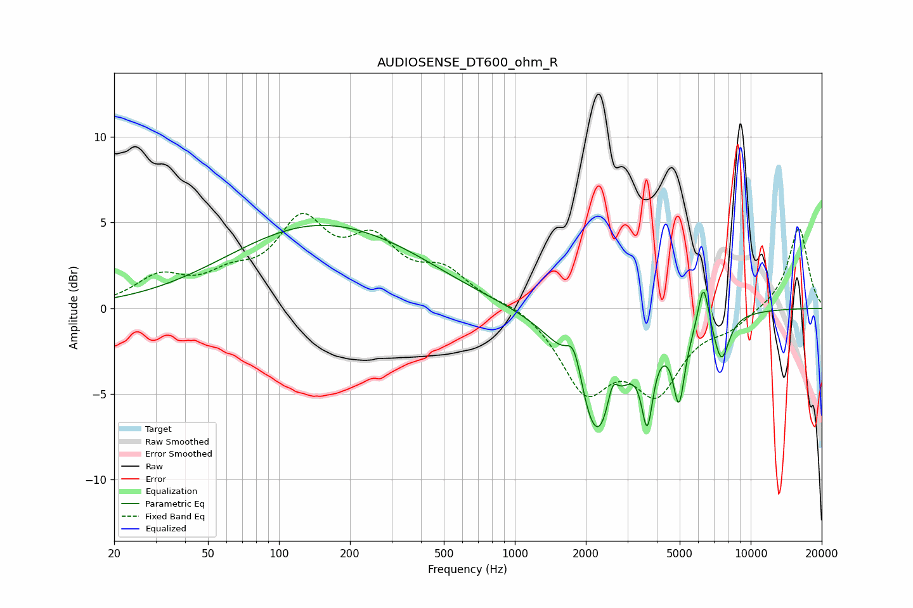

# AUDIOSENSE_DT600_ohm_R
See [usage instructions](https://github.com/jaakkopasanen/AutoEq#usage) for more options and info.

### Parametric EQs
Apply preamp of -4.9 dB when using parametric equalizer.

|   # | Type    |   Fc (Hz) |    Q |   Gain (dB) |
|-----|---------|-----------|------|-------------|
|   1 | Peaking |       147 | 0.37 |         4.7 |
|   2 | Peaking |       369 | 0.69 |         0.4 |
|   3 | Peaking |      1787 | 3.99 |         2.5 |
|   4 | Peaking |      2234 | 1.49 |        -7.9 |
|   5 | Peaking |      2592 | 6    |         1.9 |
|   6 | Peaking |      3643 | 6    |        -4.3 |
|   7 | Peaking |      4963 | 5.93 |        -3.9 |
|   8 | Peaking |      5156 | 2.28 |        -0.5 |
|   9 | Peaking |      6302 | 5.99 |         2.8 |
|  10 | Peaking |      7510 | 4.07 |        -2.7 |

### Fixed Band EQs
When using fixed band (also called graphic) equalizer, apply preamp of **-5.6 dB** (if available) and set gains manually with these parameters.

|   # | Type    |   Fc (Hz) |    Q |   Gain (dB) |
|-----|---------|-----------|------|-------------|
|   1 | Peaking |        31 | 1.41 |         1.6 |
|   2 | Peaking |        62 | 1.41 |         1.4 |
|   3 | Peaking |       125 | 1.41 |         4.6 |
|   4 | Peaking |       250 | 1.41 |         3.3 |
|   5 | Peaking |       500 | 1.41 |         1.9 |
|   6 | Peaking |      1000 | 1.41 |         0.4 |
|   7 | Peaking |      2000 | 1.41 |        -4.5 |
|   8 | Peaking |      4000 | 1.41 |        -4.4 |
|   9 | Peaking |      8000 | 1.41 |        -0.9 |
|  10 | Peaking |     16000 | 1.41 |         4.8 |

### Graphs

