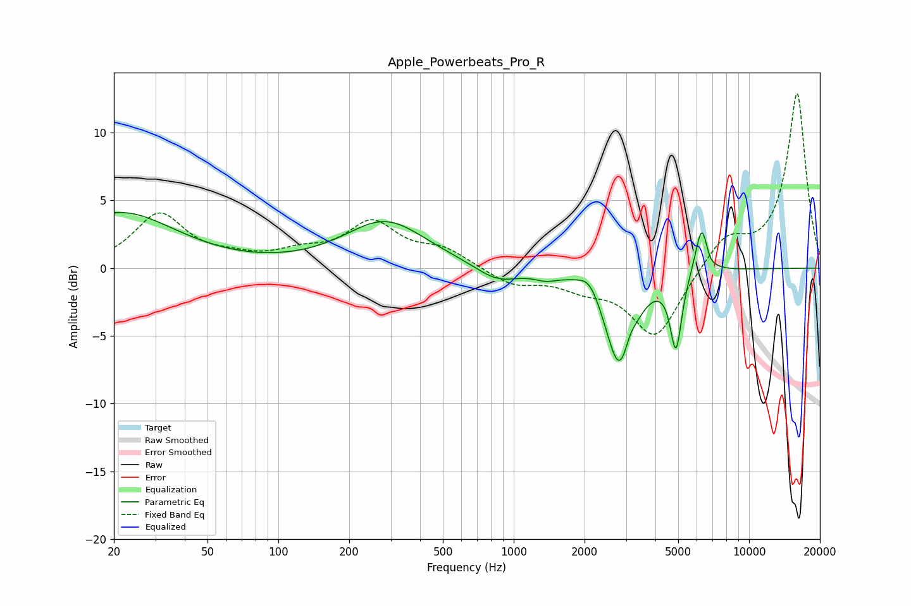

# Apple_Powerbeats_Pro_R
See [usage instructions](https://github.com/jaakkopasanen/AutoEq#usage) for more options and info.

### Parametric EQs
Apply preamp of -4.2 dB when using parametric equalizer.

|   # | Type    |   Fc (Hz) |    Q |   Gain (dB) |
|-----|---------|-----------|------|-------------|
|   1 | Peaking |        21 | 0.6  |         4.1 |
|   2 | Peaking |       285 | 0.82 |         3.4 |
|   3 | Peaking |       851 | 1.51 |        -1.2 |
|   4 | Peaking |      1371 | 2.92 |        -0.4 |
|   5 | Peaking |      2103 | 3.09 |         1.2 |
|   6 | Peaking |      2820 | 2.32 |        -7.4 |
|   7 | Peaking |      3106 | 6    |         0.9 |
|   8 | Peaking |      4892 | 5.78 |        -5.5 |
|   9 | Peaking |      6302 | 5.05 |         3.8 |
|  10 | Peaking |      6745 | 6    |        -0.6 |

### Fixed Band EQs
When using fixed band (also called graphic) equalizer, apply preamp of **-13.0 dB** (if available) and set gains manually with these parameters.

|   # | Type    |   Fc (Hz) |    Q |   Gain (dB) |
|-----|---------|-----------|------|-------------|
|   1 | Peaking |        31 | 1.41 |         3.9 |
|   2 | Peaking |        62 | 1.41 |         0.5 |
|   3 | Peaking |       125 | 1.41 |         0.9 |
|   4 | Peaking |       250 | 1.41 |         3.2 |
|   5 | Peaking |       500 | 1.41 |         1.3 |
|   6 | Peaking |      1000 | 1.41 |        -1.2 |
|   7 | Peaking |      2000 | 1.41 |        -1.1 |
|   8 | Peaking |      4000 | 1.41 |        -5.1 |
|   9 | Peaking |      8000 | 1.41 |         2.3 |
|  10 | Peaking |     16000 | 1.41 |        12.9 |

### Graphs

