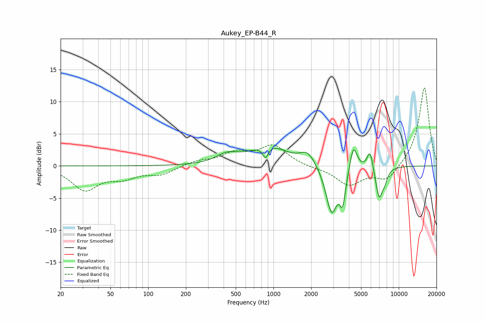

# Aukey_EP-B44_R
See [usage instructions](https://github.com/jaakkopasanen/AutoEq#usage) for more options and info.

### Parametric EQs
Apply preamp of -2.8 dB when using parametric equalizer.

|   # | Type    |   Fc (Hz) |    Q |   Gain (dB) |
|-----|---------|-----------|------|-------------|
|   1 | Peaking |       426 | 1.63 |         1.4 |
|   2 | Peaking |       863 | 6    |        -1.9 |
|   3 | Peaking |       917 | 1    |         3.1 |
|   4 | Peaking |      1873 | 2.4  |         2   |
|   5 | Peaking |      2908 | 3.06 |        -7.4 |
|   6 | Peaking |      3565 | 6    |        -4.6 |
|   7 | Peaking |      4350 | 4.96 |         3.9 |
|   8 | Peaking |      5896 | 5.91 |         3   |
|   9 | Peaking |      6968 | 4.84 |        -4.9 |
|  10 | Peaking |      7745 | 6    |        -1.4 |

### Fixed Band EQs
When using fixed band (also called graphic) equalizer, apply preamp of **-12.2 dB** (if available) and set gains manually with these parameters.

|   # | Type    |   Fc (Hz) |    Q |   Gain (dB) |
|-----|---------|-----------|------|-------------|
|   1 | Peaking |        31 | 1.41 |        -3.6 |
|   2 | Peaking |        62 | 1.41 |        -1.6 |
|   3 | Peaking |       125 | 1.41 |        -1.2 |
|   4 | Peaking |       250 | 1.41 |         0.7 |
|   5 | Peaking |       500 | 1.41 |         1.8 |
|   6 | Peaking |      1000 | 1.41 |         3.1 |
|   7 | Peaking |      2000 | 1.41 |        -0.2 |
|   8 | Peaking |      4000 | 1.41 |        -2.9 |
|   9 | Peaking |      8000 | 1.41 |        -2.3 |
|  10 | Peaking |     16000 | 1.41 |        12.4 |

### Graphs

