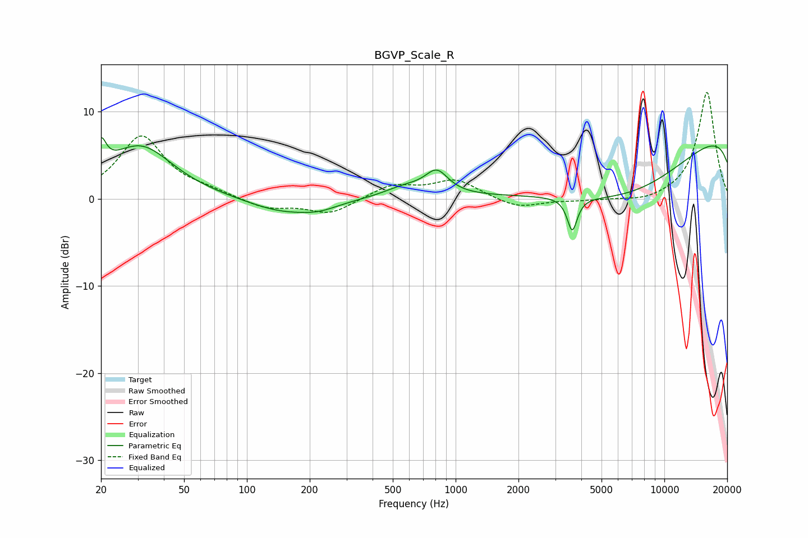

# BGVP_Scale_R
See [usage instructions](https://github.com/jaakkopasanen/AutoEq#usage) for more options and info.

### Parametric EQs
Apply preamp of -7.1 dB when using parametric equalizer.

|   # | Type    |   Fc (Hz) |    Q |   Gain (dB) |
|-----|---------|-----------|------|-------------|
|   1 | Peaking |        20 | 5.98 |         3.1 |
|   2 | Peaking |        24 | 0.55 |         1.3 |
|   3 | Peaking |        31 | 0.97 |         4.9 |
|   4 | Peaking |       147 | 0.86 |        -1.6 |
|   5 | Peaking |       222 | 1.53 |        -0.8 |
|   6 | Peaking |       570 | 1.38 |         1.1 |
|   7 | Peaking |       812 | 2.57 |         2.6 |
|   8 | Peaking |      3619 | 6    |        -3.8 |
|   9 | Peaking |      7008 | 0.28 |       -13.4 |
|  10 | Peaking |     10000 | 0.18 |        14.9 |

### Fixed Band EQs
When using fixed band (also called graphic) equalizer, apply preamp of **-12.3 dB** (if available) and set gains manually with these parameters.

|   # | Type    |   Fc (Hz) |    Q |   Gain (dB) |
|-----|---------|-----------|------|-------------|
|   1 | Peaking |        31 | 1.41 |         7.1 |
|   2 | Peaking |        62 | 1.41 |         0.7 |
|   3 | Peaking |       125 | 1.41 |        -1.2 |
|   4 | Peaking |       250 | 1.41 |        -1.7 |
|   5 | Peaking |       500 | 1.41 |         1.6 |
|   6 | Peaking |      1000 | 1.41 |         2.1 |
|   7 | Peaking |      2000 | 1.41 |        -1.1 |
|   8 | Peaking |      4000 | 1.41 |        -0.2 |
|   9 | Peaking |      8000 | 1.41 |        -0.5 |
|  10 | Peaking |     16000 | 1.41 |        12.3 |

### Graphs

