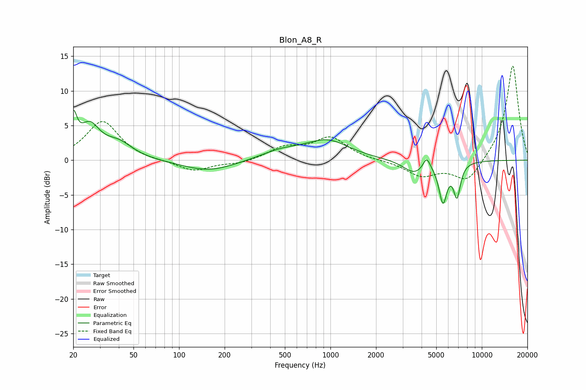

# Blon_A8_R
See [usage instructions](https://github.com/jaakkopasanen/AutoEq#usage) for more options and info.

### Parametric EQs
Apply preamp of -7.3 dB when using parametric equalizer.

|   # | Type    |   Fc (Hz) |    Q |   Gain (dB) |
|-----|---------|-----------|------|-------------|
|   1 | Peaking |        20 | 6    |         4.8 |
|   2 | Peaking |        26 | 2.12 |         4.4 |
|   3 | Peaking |        40 | 1.49 |         2.2 |
|   4 | Peaking |       157 | 0.82 |        -1.6 |
|   5 | Peaking |       472 | 1.02 |         1.2 |
|   6 | Peaking |       955 | 0.99 |         2.7 |
|   7 | Peaking |      3574 | 1.96 |        -1.8 |
|   8 | Peaking |      4321 | 5.88 |         1.8 |
|   9 | Peaking |      5537 | 5.27 |        -5.6 |
|  10 | Peaking |      6852 | 6    |        -4.7 |

### Fixed Band EQs
When using fixed band (also called graphic) equalizer, apply preamp of **-13.7 dB** (if available) and set gains manually with these parameters.

|   # | Type    |   Fc (Hz) |    Q |   Gain (dB) |
|-----|---------|-----------|------|-------------|
|   1 | Peaking |        31 | 1.41 |         5.7 |
|   2 | Peaking |        62 | 1.41 |        -0.2 |
|   3 | Peaking |       125 | 1.41 |        -1.6 |
|   4 | Peaking |       250 | 1.41 |        -0.5 |
|   5 | Peaking |       500 | 1.41 |         1.7 |
|   6 | Peaking |      1000 | 1.41 |         3.2 |
|   7 | Peaking |      2000 | 1.41 |        -0.1 |
|   8 | Peaking |      4000 | 1.41 |        -2.2 |
|   9 | Peaking |      8000 | 1.41 |        -3.2 |
|  10 | Peaking |     16000 | 1.41 |        13.9 |

### Graphs

