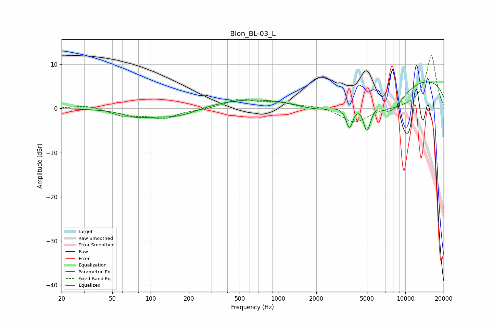

# Blon_BL-03_L
See [usage instructions](https://github.com/jaakkopasanen/AutoEq#usage) for more options and info.

### Parametric EQs
Apply preamp of -6.1 dB when using parametric equalizer.

|   # | Type    |   Fc (Hz) |    Q |   Gain (dB) |
|-----|---------|-----------|------|-------------|
|   1 | Peaking |        72 | 1.03 |         0.4 |
|   2 | Peaking |        77 | 1.25 |        -1.8 |
|   3 | Peaking |       160 | 0.79 |        -2.3 |
|   4 | Peaking |       728 | 0.32 |         2.6 |
|   5 | Peaking |      2289 | 0.61 |        -4.9 |
|   6 | Peaking |      3646 | 4.93 |        -5.5 |
|   7 | Peaking |      4963 | 5.06 |        -6   |
|   8 | Peaking |      5305 | 6    |        -0.9 |
|   9 | Peaking |      7642 | 1.14 |        -6.8 |
|  10 | Peaking |      9895 | 0.18 |         7.6 |

### Fixed Band EQs
When using fixed band (also called graphic) equalizer, apply preamp of **-12.1 dB** (if available) and set gains manually with these parameters.

|   # | Type    |   Fc (Hz) |    Q |   Gain (dB) |
|-----|---------|-----------|------|-------------|
|   1 | Peaking |        31 | 1.41 |         0.8 |
|   2 | Peaking |        62 | 1.41 |        -1.7 |
|   3 | Peaking |       125 | 1.41 |        -2.1 |
|   4 | Peaking |       250 | 1.41 |        -0.2 |
|   5 | Peaking |       500 | 1.41 |         2   |
|   6 | Peaking |      1000 | 1.41 |         1.2 |
|   7 | Peaking |      2000 | 1.41 |         0.6 |
|   8 | Peaking |      4000 | 1.41 |        -3.3 |
|   9 | Peaking |      8000 | 1.41 |        -0.2 |
|  10 | Peaking |     16000 | 1.41 |        12.1 |

### Graphs

