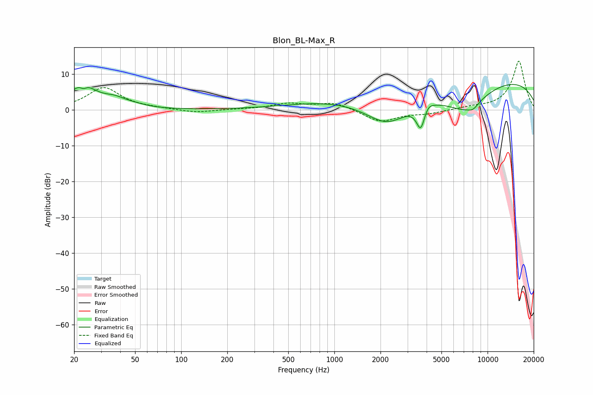

# Blon_BL-Max_R
See [usage instructions](https://github.com/jaakkopasanen/AutoEq#usage) for more options and info.

### Parametric EQs
Apply preamp of -7.2 dB when using parametric equalizer.

|   # | Type    |   Fc (Hz) |    Q |   Gain (dB) |
|-----|---------|-----------|------|-------------|
|   1 | Peaking |        23 | 1.76 |         7   |
|   2 | Peaking |        23 | 5.96 |        -1.6 |
|   3 | Peaking |        37 | 1.81 |         2.1 |
|   4 | Peaking |        50 | 1.8  |         0.6 |
|   5 | Peaking |      2220 | 0.75 |       -11.7 |
|   6 | Peaking |      3663 | 4.98 |        -6.8 |
|   7 | Peaking |      4065 | 4.58 |         1.6 |
|   8 | Peaking |      6512 | 0.2  |        17.5 |
|   9 | Peaking |      7092 | 0.59 |       -14.8 |
|  10 | Peaking |      8038 | 3.79 |        -1.3 |

### Fixed Band EQs
When using fixed band (also called graphic) equalizer, apply preamp of **-13.7 dB** (if available) and set gains manually with these parameters.

|   # | Type    |   Fc (Hz) |    Q |   Gain (dB) |
|-----|---------|-----------|------|-------------|
|   1 | Peaking |        31 | 1.41 |         6.2 |
|   2 | Peaking |        62 | 1.41 |         0.3 |
|   3 | Peaking |       125 | 1.41 |        -0.8 |
|   4 | Peaking |       250 | 1.41 |         0.1 |
|   5 | Peaking |       500 | 1.41 |         1.7 |
|   6 | Peaking |      1000 | 1.41 |         2.1 |
|   7 | Peaking |      2000 | 1.41 |        -3.4 |
|   8 | Peaking |      4000 | 1.41 |        -0.9 |
|   9 | Peaking |      8000 | 1.41 |         0.6 |
|  10 | Peaking |     16000 | 1.41 |        13.7 |

### Graphs

