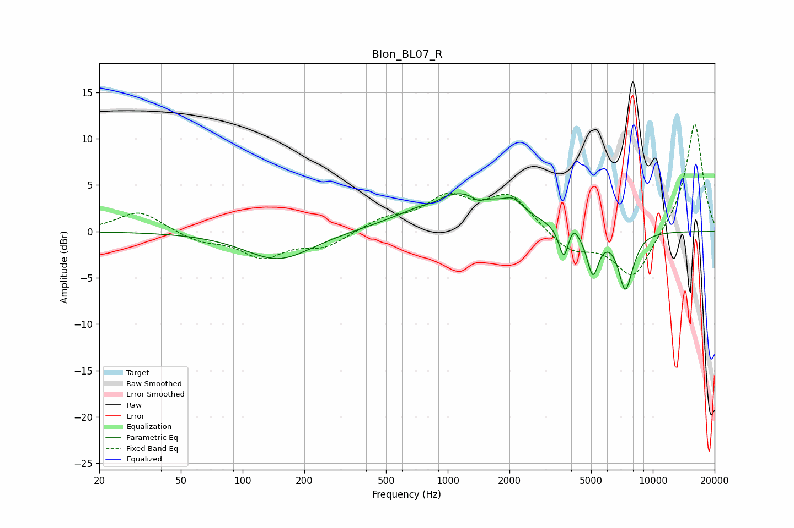

# Blon_BL07_R
See [usage instructions](https://github.com/jaakkopasanen/AutoEq#usage) for more options and info.

### Parametric EQs
Apply preamp of -4.2 dB when using parametric equalizer.

|   # | Type    |   Fc (Hz) |    Q |   Gain (dB) |
|-----|---------|-----------|------|-------------|
|   1 | Peaking |       150 | 0.86 |        -3.1 |
|   2 | Peaking |       849 | 3.63 |        -0.4 |
|   3 | Peaking |      1158 | 0.66 |         4.3 |
|   4 | Peaking |      1409 | 4.57 |        -0.7 |
|   5 | Peaking |      2092 | 3.14 |         1.2 |
|   6 | Peaking |      3679 | 5.99 |        -3.4 |
|   7 | Peaking |      4092 | 6    |         1.2 |
|   8 | Peaking |      5098 | 4.82 |        -4.6 |
|   9 | Peaking |      7330 | 4    |        -5.9 |
|  10 | Peaking |      8084 | 4.17 |        -0.6 |

### Fixed Band EQs
When using fixed band (also called graphic) equalizer, apply preamp of **-11.7 dB** (if available) and set gains manually with these parameters.

|   # | Type    |   Fc (Hz) |    Q |   Gain (dB) |
|-----|---------|-----------|------|-------------|
|   1 | Peaking |        31 | 1.41 |         2.3 |
|   2 | Peaking |        62 | 1.41 |        -1   |
|   3 | Peaking |       125 | 1.41 |        -2.6 |
|   4 | Peaking |       250 | 1.41 |        -1.6 |
|   5 | Peaking |       500 | 1.41 |         1.3 |
|   6 | Peaking |      1000 | 1.41 |         3.4 |
|   7 | Peaking |      2000 | 1.41 |         3.8 |
|   8 | Peaking |      4000 | 1.41 |        -2.1 |
|   9 | Peaking |      8000 | 1.41 |        -5.2 |
|  10 | Peaking |     16000 | 1.41 |        11.9 |

### Graphs

