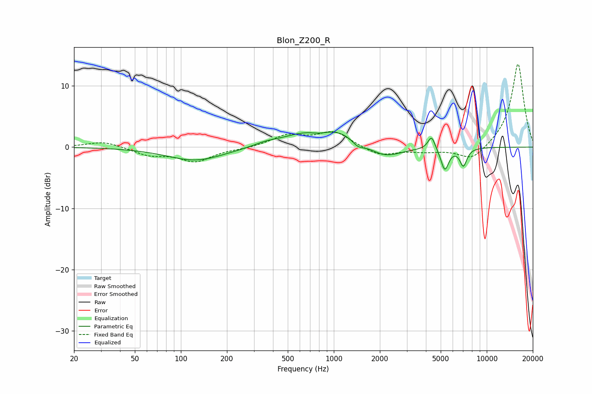

# Blon_Z200_R
See [usage instructions](https://github.com/jaakkopasanen/AutoEq#usage) for more options and info.

### Parametric EQs
Apply preamp of -2.5 dB when using parametric equalizer.

|   # | Type    |   Fc (Hz) |    Q |   Gain (dB) |
|-----|---------|-----------|------|-------------|
|   1 | Peaking |       125 | 0.76 |        -2.2 |
|   2 | Peaking |       359 | 1.9  |         0.4 |
|   3 | Peaking |       632 | 0.9  |         1.4 |
|   4 | Peaking |       802 | 2.59 |        -0.5 |
|   5 | Peaking |      1095 | 0.78 |         2.6 |
|   6 | Peaking |      1437 | 3.39 |        -1.2 |
|   7 | Peaking |      2124 | 1.24 |        -2.3 |
|   8 | Peaking |      4355 | 6    |         2.3 |
|   9 | Peaking |      5317 | 5.5  |        -3.6 |
|  10 | Peaking |      7032 | 5.81 |        -2.9 |

### Fixed Band EQs
When using fixed band (also called graphic) equalizer, apply preamp of **-13.6 dB** (if available) and set gains manually with these parameters.

|   # | Type    |   Fc (Hz) |    Q |   Gain (dB) |
|-----|---------|-----------|------|-------------|
|   1 | Peaking |        31 | 1.41 |         1   |
|   2 | Peaking |        62 | 1.41 |        -1.2 |
|   3 | Peaking |       125 | 1.41 |        -2.3 |
|   4 | Peaking |       250 | 1.41 |        -0.2 |
|   5 | Peaking |       500 | 1.41 |         1.8 |
|   6 | Peaking |      1000 | 1.41 |         2.5 |
|   7 | Peaking |      2000 | 1.41 |        -1.5 |
|   8 | Peaking |      4000 | 1.41 |        -0.6 |
|   9 | Peaking |      8000 | 1.41 |        -2.3 |
|  10 | Peaking |     16000 | 1.41 |        13.8 |

### Graphs

