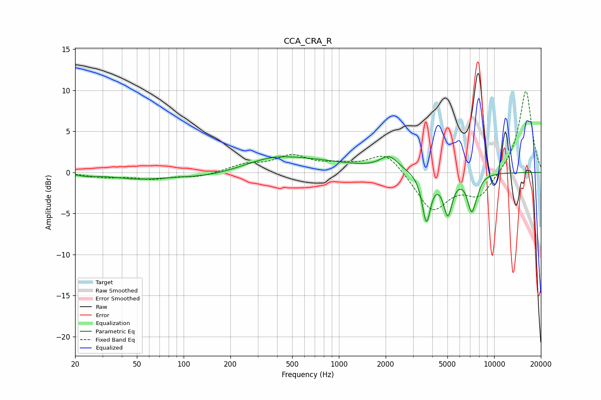

# CCA_CRA_R
See [usage instructions](https://github.com/jaakkopasanen/AutoEq#usage) for more options and info.

### Parametric EQs
Apply preamp of -2.0 dB when using parametric equalizer.

|   # | Type    |   Fc (Hz) |    Q |   Gain (dB) |
|-----|---------|-----------|------|-------------|
|   1 | Peaking |        24 | 2.61 |        -0.3 |
|   2 | Peaking |        51 | 0.88 |        -0.6 |
|   3 | Peaking |       160 | 0.55 |        -1.4 |
|   4 | Peaking |       369 | 0.93 |         0.6 |
|   5 | Peaking |       398 | 0.34 |         1.9 |
|   6 | Peaking |      2109 | 2.43 |         1.7 |
|   7 | Peaking |      3662 | 5.21 |        -5.8 |
|   8 | Peaking |      5031 | 4.8  |        -4.8 |
|   9 | Peaking |      7156 | 4.85 |        -4.2 |
|  10 | Peaking |      7789 | 6    |        -0.7 |

### Fixed Band EQs
When using fixed band (also called graphic) equalizer, apply preamp of **-10.0 dB** (if available) and set gains manually with these parameters.

|   # | Type    |   Fc (Hz) |    Q |   Gain (dB) |
|-----|---------|-----------|------|-------------|
|   1 | Peaking |        31 | 1.41 |        -0.5 |
|   2 | Peaking |        62 | 1.41 |        -0.7 |
|   3 | Peaking |       125 | 1.41 |        -0.5 |
|   4 | Peaking |       250 | 1.41 |         0.9 |
|   5 | Peaking |       500 | 1.41 |         1.9 |
|   6 | Peaking |      1000 | 1.41 |         0.7 |
|   7 | Peaking |      2000 | 1.41 |         2.6 |
|   8 | Peaking |      4000 | 1.41 |        -4.7 |
|   9 | Peaking |      8000 | 1.41 |        -2.9 |
|  10 | Peaking |     16000 | 1.41 |        10.1 |

### Graphs

