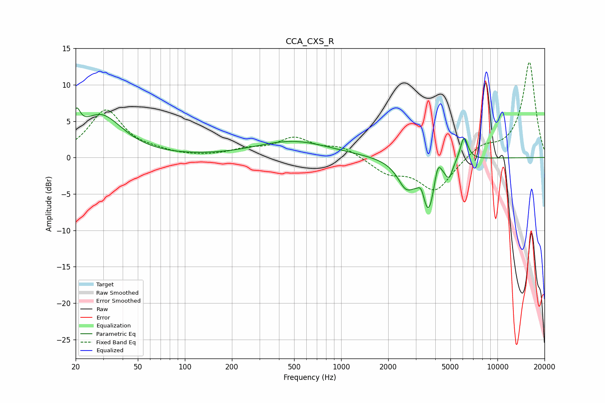

# CCA_CXS_R
See [usage instructions](https://github.com/jaakkopasanen/AutoEq#usage) for more options and info.

### Parametric EQs
Apply preamp of -6.9 dB when using parametric equalizer.

|   # | Type    |   Fc (Hz) |    Q |   Gain (dB) |
|-----|---------|-----------|------|-------------|
|   1 | Peaking |        20 | 5.71 |         3.1 |
|   2 | Peaking |        29 | 1.01 |         5.7 |
|   3 | Peaking |       491 | 0.59 |         2.2 |
|   4 | Peaking |      2588 | 2.83 |        -2.5 |
|   5 | Peaking |      2644 | 1.78 |        -0.8 |
|   6 | Peaking |      3273 | 6    |         2   |
|   7 | Peaking |      3606 | 2.94 |        -7.8 |
|   8 | Peaking |      4146 | 5.77 |         3.2 |
|   9 | Peaking |      4893 | 5.99 |        -1.9 |
|  10 | Peaking |      6110 | 5.54 |         3.4 |

### Fixed Band EQs
When using fixed band (also called graphic) equalizer, apply preamp of **-13.2 dB** (if available) and set gains manually with these parameters.

|   # | Type    |   Fc (Hz) |    Q |   Gain (dB) |
|-----|---------|-----------|------|-------------|
|   1 | Peaking |        31 | 1.41 |         6.4 |
|   2 | Peaking |        62 | 1.41 |         0.5 |
|   3 | Peaking |       125 | 1.41 |        -0   |
|   4 | Peaking |       250 | 1.41 |         0.9 |
|   5 | Peaking |       500 | 1.41 |         2.5 |
|   6 | Peaking |      1000 | 1.41 |         1.4 |
|   7 | Peaking |      2000 | 1.41 |        -2   |
|   8 | Peaking |      4000 | 1.41 |        -4.5 |
|   9 | Peaking |      8000 | 1.41 |         1.6 |
|  10 | Peaking |     16000 | 1.41 |        13.2 |

### Graphs

