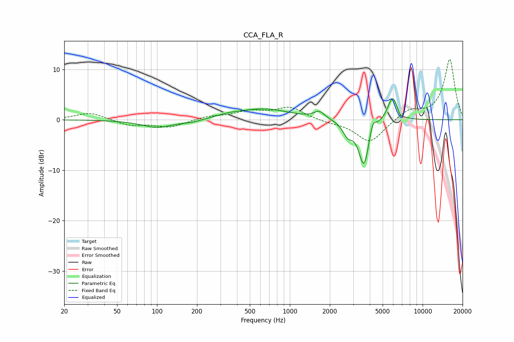

# CCA_FLA_R
See [usage instructions](https://github.com/jaakkopasanen/AutoEq#usage) for more options and info.

### Parametric EQs
Apply preamp of -4.2 dB when using parametric equalizer.

|   # | Type    |   Fc (Hz) |    Q |   Gain (dB) |
|-----|---------|-----------|------|-------------|
|   1 | Peaking |       101 | 1.15 |        -1.6 |
|   2 | Peaking |       185 | 2.08 |        -0.4 |
|   3 | Peaking |       347 | 1.78 |         0.4 |
|   4 | Peaking |       629 | 0.69 |         2.1 |
|   5 | Peaking |      1665 | 3.57 |         1.4 |
|   6 | Peaking |      2723 | 4    |        -2.4 |
|   7 | Peaking |      3615 | 3.47 |        -9.3 |
|   8 | Peaking |      4206 | 6    |         2.6 |
|   9 | Peaking |      5944 | 3.62 |         4.9 |
|  10 | Peaking |      6798 | 6    |        -0.9 |

### Fixed Band EQs
When using fixed band (also called graphic) equalizer, apply preamp of **-12.1 dB** (if available) and set gains manually with these parameters.

|   # | Type    |   Fc (Hz) |    Q |   Gain (dB) |
|-----|---------|-----------|------|-------------|
|   1 | Peaking |        31 | 1.41 |         1.5 |
|   2 | Peaking |        62 | 1.41 |        -1.1 |
|   3 | Peaking |       125 | 1.41 |        -1.5 |
|   4 | Peaking |       250 | 1.41 |         0.6 |
|   5 | Peaking |       500 | 1.41 |         1.5 |
|   6 | Peaking |      1000 | 1.41 |         2.4 |
|   7 | Peaking |      2000 | 1.41 |        -0.4 |
|   8 | Peaking |      4000 | 1.41 |        -4.6 |
|   9 | Peaking |      8000 | 1.41 |         1.9 |
|  10 | Peaking |     16000 | 1.41 |        12   |

### Graphs

