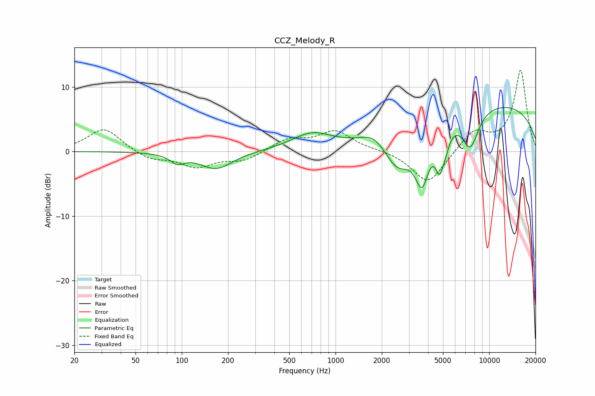

# CCZ_Melody_R
See [usage instructions](https://github.com/jaakkopasanen/AutoEq#usage) for more options and info.

### Parametric EQs
Apply preamp of -6.9 dB when using parametric equalizer.

|   # | Type    |   Fc (Hz) |    Q |   Gain (dB) |
|-----|---------|-----------|------|-------------|
|   1 | Peaking |        93 | 3.14 |        -1.3 |
|   2 | Peaking |       167 | 1.33 |        -2.7 |
|   3 | Peaking |       705 | 1.05 |         2.6 |
|   4 | Peaking |      1776 | 1.7  |         2   |
|   5 | Peaking |      2533 | 1.5  |        -5.6 |
|   6 | Peaking |      3653 | 2.95 |        -7.7 |
|   7 | Peaking |      4744 | 5.18 |        -4.9 |
|   8 | Peaking |      5182 | 5.09 |        -2.1 |
|   9 | Peaking |      7538 | 2.46 |        -5.8 |
|  10 | Peaking |     10000 | 0.22 |         7.5 |

### Fixed Band EQs
When using fixed band (also called graphic) equalizer, apply preamp of **-12.7 dB** (if available) and set gains manually with these parameters.

|   # | Type    |   Fc (Hz) |    Q |   Gain (dB) |
|-----|---------|-----------|------|-------------|
|   1 | Peaking |        31 | 1.41 |         3.7 |
|   2 | Peaking |        62 | 1.41 |        -1.3 |
|   3 | Peaking |       125 | 1.41 |        -2.3 |
|   4 | Peaking |       250 | 1.41 |        -1.4 |
|   5 | Peaking |       500 | 1.41 |         1.9 |
|   6 | Peaking |      1000 | 1.41 |         3   |
|   7 | Peaking |      2000 | 1.41 |         0.2 |
|   8 | Peaking |      4000 | 1.41 |        -5.1 |
|   9 | Peaking |      8000 | 1.41 |         3.1 |
|  10 | Peaking |     16000 | 1.41 |        12.6 |

### Graphs

