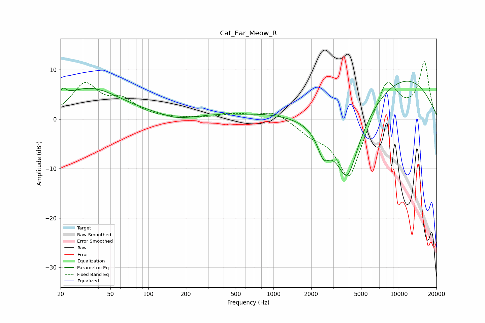

# Cat_Ear_Meow_R
See [usage instructions](https://github.com/jaakkopasanen/AutoEq#usage) for more options and info.

### Parametric EQs
Apply preamp of -7.8 dB when using parametric equalizer.

|   # | Type    |   Fc (Hz) |    Q |   Gain (dB) |
|-----|---------|-----------|------|-------------|
|   1 | Peaking |        21 | 5.79 |         1.6 |
|   2 | Peaking |        34 | 0.54 |         6.2 |
|   3 | Peaking |       167 | 1.39 |        -0.7 |
|   4 | Peaking |       310 | 3.08 |         0.2 |
|   5 | Peaking |       419 | 5.6  |         0.4 |
|   6 | Peaking |      1020 | 0.39 |         1.4 |
|   7 | Peaking |      2506 | 2.93 |        -4.5 |
|   8 | Peaking |      3878 | 1.24 |       -15.9 |
|   9 | Peaking |      9953 | 0.38 |         4.4 |
|  10 | Peaking |     10000 | 0.34 |         4.7 |

### Fixed Band EQs
When using fixed band (also called graphic) equalizer, apply preamp of **-11.7 dB** (if available) and set gains manually with these parameters.

|   # | Type    |   Fc (Hz) |    Q |   Gain (dB) |
|-----|---------|-----------|------|-------------|
|   1 | Peaking |        31 | 1.41 |         6.8 |
|   2 | Peaking |        62 | 1.41 |         3.3 |
|   3 | Peaking |       125 | 1.41 |         0.1 |
|   4 | Peaking |       250 | 1.41 |         0.1 |
|   5 | Peaking |       500 | 1.41 |         1   |
|   6 | Peaking |      1000 | 1.41 |         1.7 |
|   7 | Peaking |      2000 | 1.41 |        -2.1 |
|   8 | Peaking |      4000 | 1.41 |       -12.7 |
|   9 | Peaking |      8000 | 1.41 |         8.8 |
|  10 | Peaking |     16000 | 1.41 |        11.4 |

### Graphs

