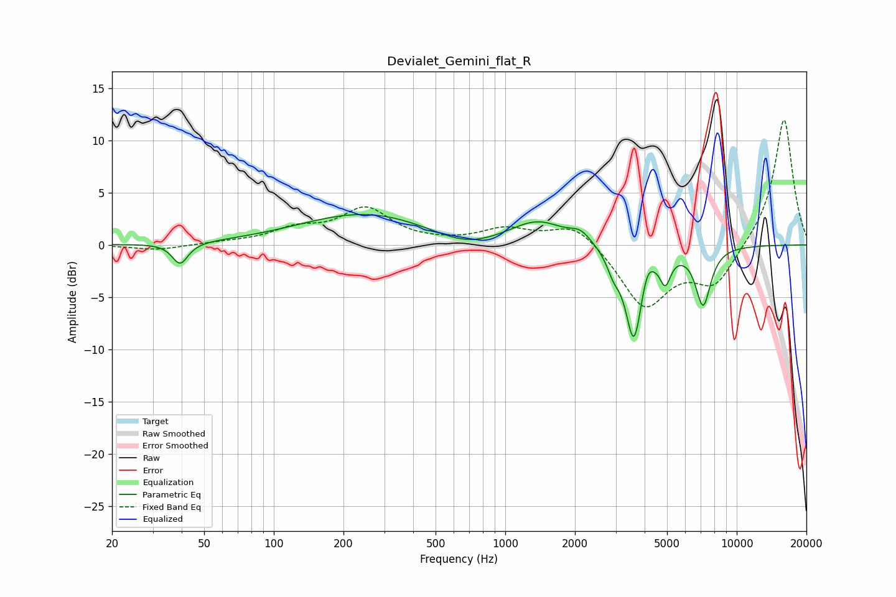

# Devialet_Gemini_flat_R
See [usage instructions](https://github.com/jaakkopasanen/AutoEq#usage) for more options and info.

### Parametric EQs
Apply preamp of -3.0 dB when using parametric equalizer.

|   # | Type    |   Fc (Hz) |    Q |   Gain (dB) |
|-----|---------|-----------|------|-------------|
|   1 | Peaking |        39 | 4.25 |        -2   |
|   2 | Peaking |       251 | 0.49 |         3   |
|   3 | Peaking |       672 | 1.02 |        -1.3 |
|   4 | Peaking |      1379 | 1.19 |         2.2 |
|   5 | Peaking |      2114 | 3.28 |         1   |
|   6 | Peaking |      2935 | 4.87 |        -1.6 |
|   7 | Peaking |      3594 | 3.84 |        -9   |
|   8 | Peaking |      4099 | 5.57 |         1.6 |
|   9 | Peaking |      4915 | 6    |        -2.6 |
|  10 | Peaking |      7160 | 4.11 |        -5.5 |

### Fixed Band EQs
When using fixed band (also called graphic) equalizer, apply preamp of **-12.0 dB** (if available) and set gains manually with these parameters.

|   # | Type    |   Fc (Hz) |    Q |   Gain (dB) |
|-----|---------|-----------|------|-------------|
|   1 | Peaking |        31 | 1.41 |        -0.5 |
|   2 | Peaking |        62 | 1.41 |         0.2 |
|   3 | Peaking |       125 | 1.41 |         1.3 |
|   4 | Peaking |       250 | 1.41 |         3.3 |
|   5 | Peaking |       500 | 1.41 |         0.1 |
|   6 | Peaking |      1000 | 1.41 |         1.4 |
|   7 | Peaking |      2000 | 1.41 |         2.2 |
|   8 | Peaking |      4000 | 1.41 |        -5.9 |
|   9 | Peaking |      8000 | 1.41 |        -3.8 |
|  10 | Peaking |     16000 | 1.41 |        12.3 |

### Graphs

