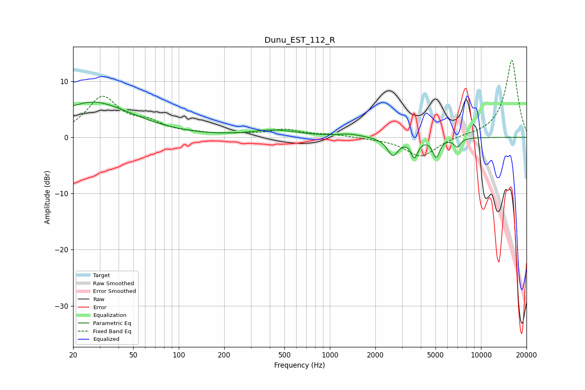

# Dunu_EST_112_R
See [usage instructions](https://github.com/jaakkopasanen/AutoEq#usage) for more options and info.

### Parametric EQs
Apply preamp of -6.4 dB when using parametric equalizer.

|   # | Type    |   Fc (Hz) |    Q |   Gain (dB) |
|-----|---------|-----------|------|-------------|
|   1 | Peaking |        20 | 6    |         4.1 |
|   2 | Peaking |        20 | 6    |        -4   |
|   3 | Peaking |        26 | 0.97 |         1.3 |
|   4 | Peaking |        28 | 0.49 |         4.9 |
|   5 | Peaking |       431 | 0.94 |         1.2 |
|   6 | Peaking |      1348 | 1.85 |         0.5 |
|   7 | Peaking |      2612 | 4    |        -3.1 |
|   8 | Peaking |      3625 | 6    |        -3.2 |
|   9 | Peaking |      5049 | 6    |        -3.3 |
|  10 | Peaking |      6951 | 6    |        -1.5 |

### Fixed Band EQs
When using fixed band (also called graphic) equalizer, apply preamp of **-13.8 dB** (if available) and set gains manually with these parameters.

|   # | Type    |   Fc (Hz) |    Q |   Gain (dB) |
|-----|---------|-----------|------|-------------|
|   1 | Peaking |        31 | 1.41 |         6.9 |
|   2 | Peaking |        62 | 1.41 |         2   |
|   3 | Peaking |       125 | 1.41 |         0.5 |
|   4 | Peaking |       250 | 1.41 |         0.4 |
|   5 | Peaking |       500 | 1.41 |         1.2 |
|   6 | Peaking |      1000 | 1.41 |         0.5 |
|   7 | Peaking |      2000 | 1.41 |        -0.2 |
|   8 | Peaking |      4000 | 1.41 |        -3.5 |
|   9 | Peaking |      8000 | 1.41 |         0.2 |
|  10 | Peaking |     16000 | 1.41 |        13.8 |

### Graphs

