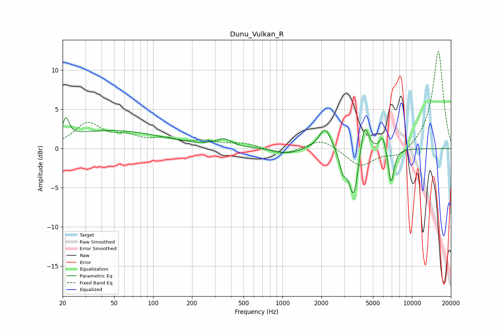

# Dunu_Vulkan_R
See [usage instructions](https://github.com/jaakkopasanen/AutoEq#usage) for more options and info.

### Parametric EQs
Apply preamp of -4.0 dB when using parametric equalizer.

|   # | Type    |   Fc (Hz) |    Q |   Gain (dB) |
|-----|---------|-----------|------|-------------|
|   1 | Peaking |        21 | 5.93 |         2.3 |
|   2 | Peaking |        48 | 0.35 |         2.3 |
|   3 | Peaking |       352 | 2.43 |         1   |
|   4 | Peaking |      1091 | 1.58 |        -0.7 |
|   5 | Peaking |      2138 | 2.93 |         2.9 |
|   6 | Peaking |      2925 | 5.23 |        -2.3 |
|   7 | Peaking |      3553 | 3.86 |        -6.5 |
|   8 | Peaking |      4295 | 4.33 |         4.3 |
|   9 | Peaking |      5950 | 6    |         2.1 |
|  10 | Peaking |      6910 | 6    |        -4.5 |

### Fixed Band EQs
When using fixed band (also called graphic) equalizer, apply preamp of **-12.5 dB** (if available) and set gains manually with these parameters.

|   # | Type    |   Fc (Hz) |    Q |   Gain (dB) |
|-----|---------|-----------|------|-------------|
|   1 | Peaking |        31 | 1.41 |         3.1 |
|   2 | Peaking |        62 | 1.41 |         1.2 |
|   3 | Peaking |       125 | 1.41 |         1   |
|   4 | Peaking |       250 | 1.41 |         0.8 |
|   5 | Peaking |       500 | 1.41 |         0.6 |
|   6 | Peaking |      1000 | 1.41 |        -0.9 |
|   7 | Peaking |      2000 | 1.41 |         1.3 |
|   8 | Peaking |      4000 | 1.41 |        -2.3 |
|   9 | Peaking |      8000 | 1.41 |        -1.2 |
|  10 | Peaking |     16000 | 1.41 |        12.6 |

### Graphs

