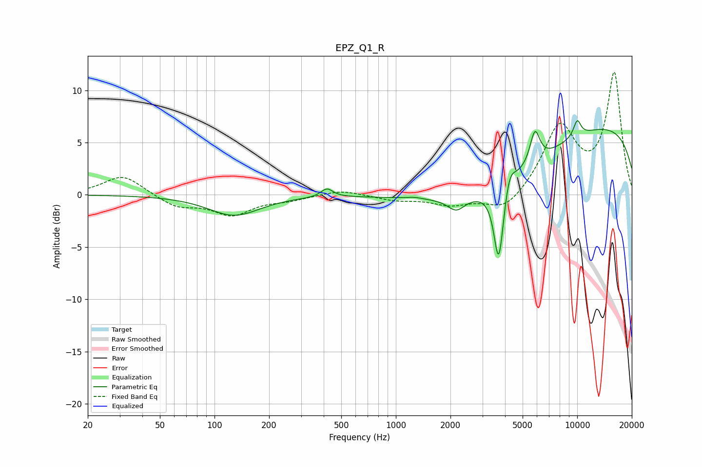

# EPZ_Q1_R
See [usage instructions](https://github.com/jaakkopasanen/AutoEq#usage) for more options and info.

### Parametric EQs
Apply preamp of -7.2 dB when using parametric equalizer.

|   # | Type    |   Fc (Hz) |    Q |   Gain (dB) |
|-----|---------|-----------|------|-------------|
|   1 | Peaking |       128 | 1    |        -2   |
|   2 | Peaking |       417 | 4.31 |         0.8 |
|   3 | Peaking |      1262 | 3.15 |         0.2 |
|   4 | Peaking |      2154 | 3.04 |        -1.2 |
|   5 | Peaking |      3586 | 0.41 |        -4.6 |
|   6 | Peaking |      3694 | 5.3  |        -7.5 |
|   7 | Peaking |      4236 | 4.68 |         1.9 |
|   8 | Peaking |      5845 | 5.01 |         3.2 |
|   9 | Peaking |     10000 | 0.18 |         7.3 |
|  10 | Peaking |     10000 | 5.76 |         1.6 |

### Fixed Band EQs
When using fixed band (also called graphic) equalizer, apply preamp of **-11.8 dB** (if available) and set gains manually with these parameters.

|   # | Type    |   Fc (Hz) |    Q |   Gain (dB) |
|-----|---------|-----------|------|-------------|
|   1 | Peaking |        31 | 1.41 |         1.9 |
|   2 | Peaking |        62 | 1.41 |        -1.1 |
|   3 | Peaking |       125 | 1.41 |        -1.8 |
|   4 | Peaking |       250 | 1.41 |        -0.4 |
|   5 | Peaking |       500 | 1.41 |         0.5 |
|   6 | Peaking |      1000 | 1.41 |        -0.5 |
|   7 | Peaking |      2000 | 1.41 |        -0.9 |
|   8 | Peaking |      4000 | 1.41 |        -1.7 |
|   9 | Peaking |      8000 | 1.41 |         6.4 |
|  10 | Peaking |     16000 | 1.41 |        11.5 |

### Graphs

