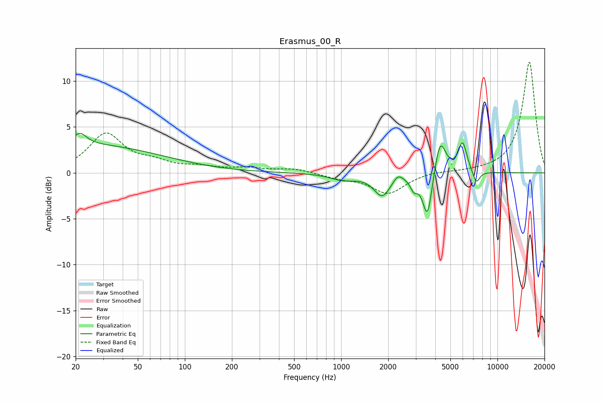

# Erasmus_00_R
See [usage instructions](https://github.com/jaakkopasanen/AutoEq#usage) for more options and info.

### Parametric EQs
Apply preamp of -4.4 dB when using parametric equalizer.

|   # | Type    |   Fc (Hz) |    Q |   Gain (dB) |
|-----|---------|-----------|------|-------------|
|   1 | Peaking |        21 | 3.39 |         1.3 |
|   2 | Peaking |        23 | 0.28 |         3   |
|   3 | Peaking |      1031 | 1.66 |        -0.7 |
|   4 | Peaking |      1831 | 2.67 |        -2.4 |
|   5 | Peaking |      2305 | 4.85 |         0.8 |
|   6 | Peaking |      2923 | 5.99 |        -1.3 |
|   7 | Peaking |      3568 | 4.65 |        -5.1 |
|   8 | Peaking |      4298 | 3.95 |         4   |
|   9 | Peaking |      5984 | 5.05 |         3.2 |
|  10 | Peaking |      7321 | 6    |        -1.4 |

### Fixed Band EQs
When using fixed band (also called graphic) equalizer, apply preamp of **-12.1 dB** (if available) and set gains manually with these parameters.

|   # | Type    |   Fc (Hz) |    Q |   Gain (dB) |
|-----|---------|-----------|------|-------------|
|   1 | Peaking |        31 | 1.41 |         4.1 |
|   2 | Peaking |        62 | 1.41 |         0.9 |
|   3 | Peaking |       125 | 1.41 |         0.5 |
|   4 | Peaking |       250 | 1.41 |         0.4 |
|   5 | Peaking |       500 | 1.41 |         0.4 |
|   6 | Peaking |      1000 | 1.41 |        -0.5 |
|   7 | Peaking |      2000 | 1.41 |        -2.2 |
|   8 | Peaking |      4000 | 1.41 |         0.2 |
|   9 | Peaking |      8000 | 1.41 |         0.1 |
|  10 | Peaking |     16000 | 1.41 |        12.1 |

### Graphs

