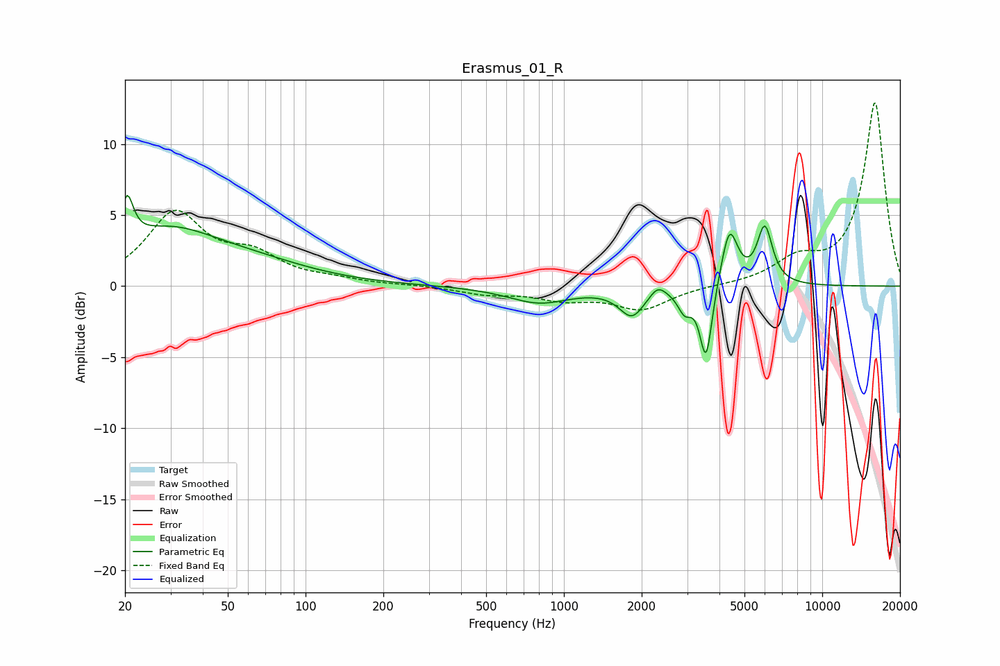

# Erasmus_01_R
See [usage instructions](https://github.com/jaakkopasanen/AutoEq#usage) for more options and info.

### Parametric EQs
Apply preamp of -6.5 dB when using parametric equalizer.

|   # | Type    |   Fc (Hz) |    Q |   Gain (dB) |
|-----|---------|-----------|------|-------------|
|   1 | Peaking |        20 | 6    |         3.2 |
|   2 | Peaking |        29 | 0.69 |         3.6 |
|   3 | Peaking |        66 | 0.62 |         1   |
|   4 | Peaking |       801 | 1.18 |        -1.2 |
|   5 | Peaking |      1834 | 2.91 |        -2   |
|   6 | Peaking |      2307 | 4.7  |         0.8 |
|   7 | Peaking |      2936 | 5.23 |        -1.5 |
|   8 | Peaking |      3550 | 5.99 |        -5.3 |
|   9 | Peaking |      4373 | 4.37 |         4.1 |
|  10 | Peaking |      5993 | 4.69 |         4   |

### Fixed Band EQs
When using fixed band (also called graphic) equalizer, apply preamp of **-13.0 dB** (if available) and set gains manually with these parameters.

|   # | Type    |   Fc (Hz) |    Q |   Gain (dB) |
|-----|---------|-----------|------|-------------|
|   1 | Peaking |        31 | 1.41 |         5   |
|   2 | Peaking |        62 | 1.41 |         1.8 |
|   3 | Peaking |       125 | 1.41 |         0.3 |
|   4 | Peaking |       250 | 1.41 |         0.1 |
|   5 | Peaking |       500 | 1.41 |        -0.5 |
|   6 | Peaking |      1000 | 1.41 |        -0.8 |
|   7 | Peaking |      2000 | 1.41 |        -1.6 |
|   8 | Peaking |      4000 | 1.41 |         0   |
|   9 | Peaking |      8000 | 1.41 |         1.6 |
|  10 | Peaking |     16000 | 1.41 |        12.9 |

### Graphs

