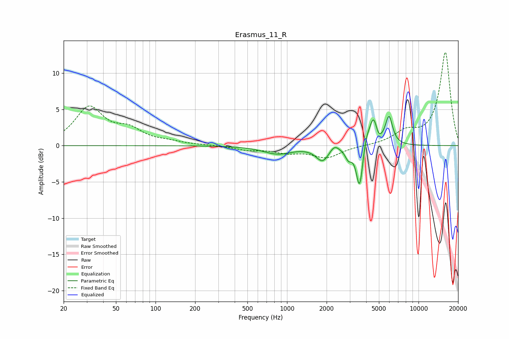

# Erasmus_11_R
See [usage instructions](https://github.com/jaakkopasanen/AutoEq#usage) for more options and info.

### Parametric EQs
Apply preamp of -4.1 dB when using parametric equalizer.

|   # | Type    |   Fc (Hz) |    Q |   Gain (dB) |
|-----|---------|-----------|------|-------------|
|   1 | Peaking |       847 | 1.28 |        -1.1 |
|   2 | Peaking |      1865 | 2.88 |        -2   |
|   3 | Peaking |      2288 | 4.24 |         0.9 |
|   4 | Peaking |      2932 | 5.53 |        -1.4 |
|   5 | Peaking |      3561 | 5.74 |        -5.3 |
|   6 | Peaking |      3592 | 6    |        -0.8 |
|   7 | Peaking |      3988 | 5.99 |         1.4 |
|   8 | Peaking |      4545 | 4.37 |         4   |
|   9 | Peaking |      4946 | 6    |        -1   |
|  10 | Peaking |      5966 | 5.12 |         3.8 |

### Fixed Band EQs
When using fixed band (also called graphic) equalizer, apply preamp of **-13.0 dB** (if available) and set gains manually with these parameters.

|   # | Type    |   Fc (Hz) |    Q |   Gain (dB) |
|-----|---------|-----------|------|-------------|
|   1 | Peaking |        31 | 1.41 |         5.1 |
|   2 | Peaking |        62 | 1.41 |         1.9 |
|   3 | Peaking |       125 | 1.41 |         0.4 |
|   4 | Peaking |       250 | 1.41 |         0.1 |
|   5 | Peaking |       500 | 1.41 |        -0.5 |
|   6 | Peaking |      1000 | 1.41 |        -0.8 |
|   7 | Peaking |      2000 | 1.41 |        -1.6 |
|   8 | Peaking |      4000 | 1.41 |        -0   |
|   9 | Peaking |      8000 | 1.41 |         1.6 |
|  10 | Peaking |     16000 | 1.41 |        12.9 |

### Graphs

