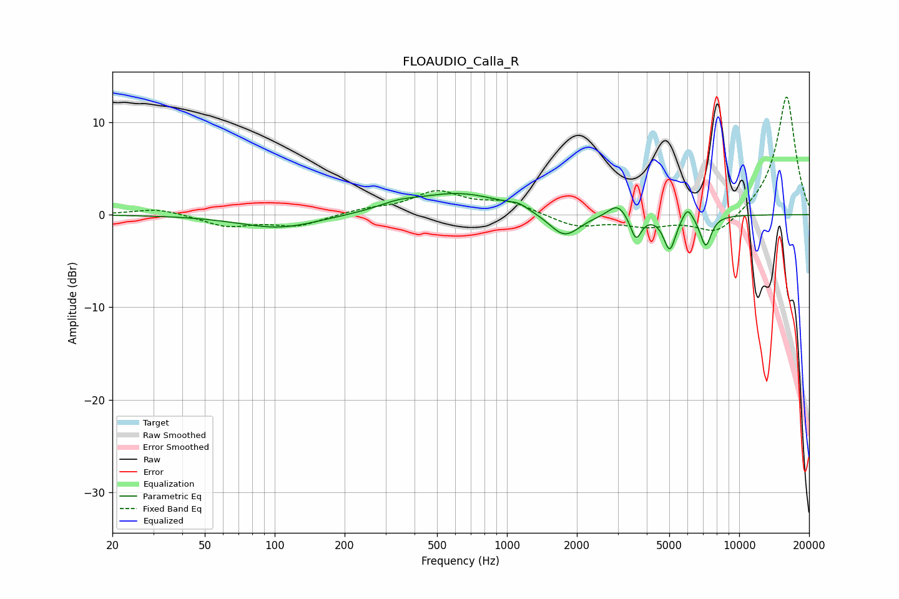

# FLOAUDIO_Calla_R
See [usage instructions](https://github.com/jaakkopasanen/AutoEq#usage) for more options and info.

### Parametric EQs
Apply preamp of -2.4 dB when using parametric equalizer.

|   # | Type    |   Fc (Hz) |    Q |   Gain (dB) |
|-----|---------|-----------|------|-------------|
|   1 | Peaking |       105 | 0.83 |        -1.5 |
|   2 | Peaking |       338 | 1.8  |         0.5 |
|   3 | Peaking |       620 | 0.7  |         2.3 |
|   4 | Peaking |      1122 | 3.87 |         0.5 |
|   5 | Peaking |      1769 | 2.1  |        -2.7 |
|   6 | Peaking |      2992 | 3.58 |         1.5 |
|   7 | Peaking |      3593 | 6    |        -2.6 |
|   8 | Peaking |      5021 | 5.42 |        -3.7 |
|   9 | Peaking |      5990 | 6    |         1.5 |
|  10 | Peaking |      7176 | 5.67 |        -3.3 |

### Fixed Band EQs
When using fixed band (also called graphic) equalizer, apply preamp of **-12.8 dB** (if available) and set gains manually with these parameters.

|   # | Type    |   Fc (Hz) |    Q |   Gain (dB) |
|-----|---------|-----------|------|-------------|
|   1 | Peaking |        31 | 1.41 |         0.7 |
|   2 | Peaking |        62 | 1.41 |        -1.2 |
|   3 | Peaking |       125 | 1.41 |        -1.2 |
|   4 | Peaking |       250 | 1.41 |         0.5 |
|   5 | Peaking |       500 | 1.41 |         2.4 |
|   6 | Peaking |      1000 | 1.41 |         1.3 |
|   7 | Peaking |      2000 | 1.41 |        -1.3 |
|   8 | Peaking |      4000 | 1.41 |        -1.1 |
|   9 | Peaking |      8000 | 1.41 |        -2.3 |
|  10 | Peaking |     16000 | 1.41 |        12.9 |

### Graphs

