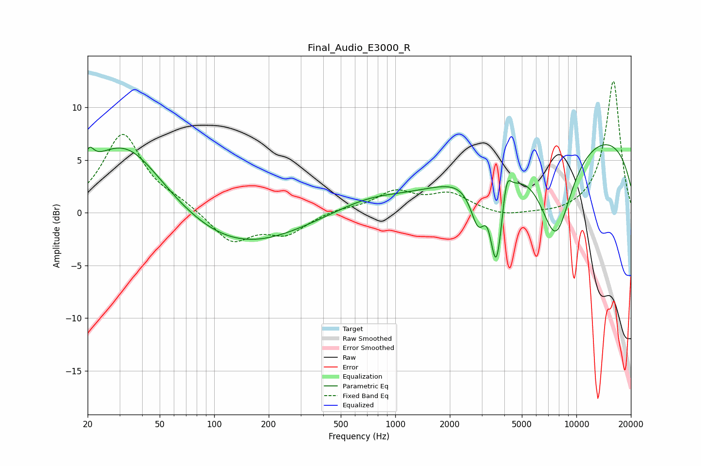

# Final_Audio_E3000_R
See [usage instructions](https://github.com/jaakkopasanen/AutoEq#usage) for more options and info.

### Parametric EQs
Apply preamp of -6.6 dB when using parametric equalizer.

|   # | Type    |   Fc (Hz) |    Q |   Gain (dB) |
|-----|---------|-----------|------|-------------|
|   1 | Peaking |        20 | 5.62 |         1.6 |
|   2 | Peaking |        32 | 0.65 |         7   |
|   3 | Peaking |       131 | 0.42 |        -3.5 |
|   4 | Peaking |       713 | 0.71 |         1.2 |
|   5 | Peaking |      2870 | 3.27 |        -3.9 |
|   6 | Peaking |      3241 | 4.94 |         1.3 |
|   7 | Peaking |      3613 | 3.67 |        -9.1 |
|   8 | Peaking |      4107 | 6    |         3   |
|   9 | Peaking |      7684 | 1.41 |        -9.3 |
|  10 | Peaking |     10000 | 0.2  |         8   |

### Fixed Band EQs
When using fixed band (also called graphic) equalizer, apply preamp of **-12.6 dB** (if available) and set gains manually with these parameters.

|   # | Type    |   Fc (Hz) |    Q |   Gain (dB) |
|-----|---------|-----------|------|-------------|
|   1 | Peaking |        31 | 1.41 |         7.4 |
|   2 | Peaking |        62 | 1.41 |         0.8 |
|   3 | Peaking |       125 | 1.41 |        -2.8 |
|   4 | Peaking |       250 | 1.41 |        -1.9 |
|   5 | Peaking |       500 | 1.41 |         0.3 |
|   6 | Peaking |      1000 | 1.41 |         1.9 |
|   7 | Peaking |      2000 | 1.41 |         1.7 |
|   8 | Peaking |      4000 | 1.41 |        -0.5 |
|   9 | Peaking |      8000 | 1.41 |        -0.2 |
|  10 | Peaking |     16000 | 1.41 |        12.6 |

### Graphs

