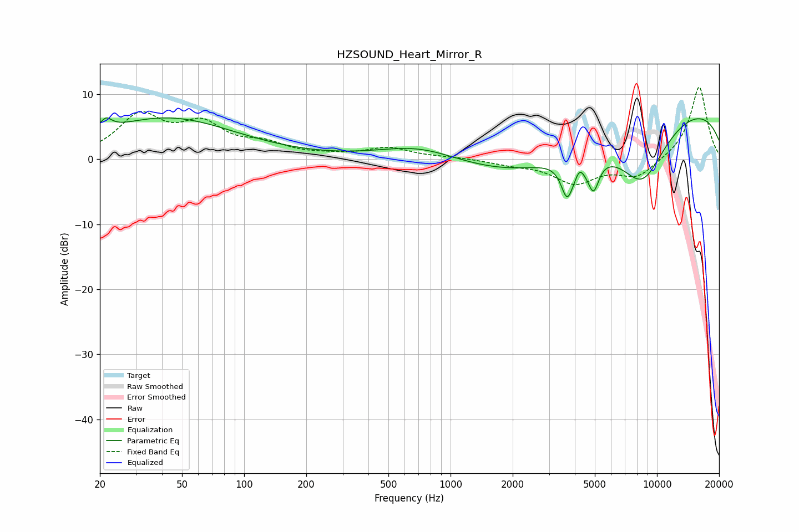

# HZSOUND_Heart_Mirror_R
See [usage instructions](https://github.com/jaakkopasanen/AutoEq#usage) for more options and info.

### Parametric EQs
Apply preamp of -6.4 dB when using parametric equalizer.

|   # | Type    |   Fc (Hz) |    Q |   Gain (dB) |
|-----|---------|-----------|------|-------------|
|   1 | Peaking |        21 | 4.88 |         1.8 |
|   2 | Peaking |        42 | 0.42 |         6.3 |
|   3 | Peaking |       704 | 0.73 |         2.3 |
|   4 | Peaking |      2405 | 0.46 |        -5.3 |
|   5 | Peaking |      3661 | 5.08 |        -4.5 |
|   6 | Peaking |      4090 | 3    |        -2.9 |
|   7 | Peaking |      4203 | 5.86 |         2.6 |
|   8 | Peaking |      4929 | 5.22 |        -4.6 |
|   9 | Peaking |      8477 | 1    |       -10.6 |
|  10 | Peaking |     10000 | 0.19 |         9.2 |

### Fixed Band EQs
When using fixed band (also called graphic) equalizer, apply preamp of **-11.1 dB** (if available) and set gains manually with these parameters.

|   # | Type    |   Fc (Hz) |    Q |   Gain (dB) |
|-----|---------|-----------|------|-------------|
|   1 | Peaking |        31 | 1.41 |         6.3 |
|   2 | Peaking |        62 | 1.41 |         4.7 |
|   3 | Peaking |       125 | 1.41 |         1.9 |
|   4 | Peaking |       250 | 1.41 |         0.4 |
|   5 | Peaking |       500 | 1.41 |         1.6 |
|   6 | Peaking |      1000 | 1.41 |         0.2 |
|   7 | Peaking |      2000 | 1.41 |        -0.7 |
|   8 | Peaking |      4000 | 1.41 |        -3.6 |
|   9 | Peaking |      8000 | 1.41 |        -2.8 |
|  10 | Peaking |     16000 | 1.41 |        11.3 |

### Graphs

