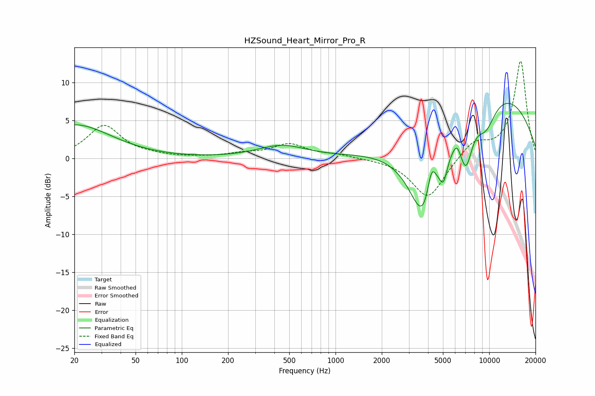

# HZSound_Heart_Mirror_Pro_R
See [usage instructions](https://github.com/jaakkopasanen/AutoEq#usage) for more options and info.

### Parametric EQs
Apply preamp of -7.4 dB when using parametric equalizer.

|   # | Type    |   Fc (Hz) |    Q |   Gain (dB) |
|-----|---------|-----------|------|-------------|
|   1 | Peaking |        20 | 0.6  |         4.4 |
|   2 | Peaking |       447 | 0.9  |         1.6 |
|   3 | Peaking |      3750 | 1.31 |       -12.7 |
|   4 | Peaking |      4208 | 4.99 |         3.8 |
|   5 | Peaking |      4993 | 5.92 |        -1.7 |
|   6 | Peaking |      5119 | 4.99 |        -1.3 |
|   7 | Peaking |      6161 | 5.81 |         1.1 |
|   8 | Peaking |      7058 | 3.15 |        -5.9 |
|   9 | Peaking |      9515 | 1.85 |        -3.7 |
|  10 | Peaking |      9624 | 0.29 |         9.5 |

### Fixed Band EQs
When using fixed band (also called graphic) equalizer, apply preamp of **-12.9 dB** (if available) and set gains manually with these parameters.

|   # | Type    |   Fc (Hz) |    Q |   Gain (dB) |
|-----|---------|-----------|------|-------------|
|   1 | Peaking |        31 | 1.41 |         4.3 |
|   2 | Peaking |        62 | 1.41 |         0.2 |
|   3 | Peaking |       125 | 1.41 |         0.1 |
|   4 | Peaking |       250 | 1.41 |         0.5 |
|   5 | Peaking |       500 | 1.41 |         1.8 |
|   6 | Peaking |      1000 | 1.41 |         0.4 |
|   7 | Peaking |      2000 | 1.41 |        -0   |
|   8 | Peaking |      4000 | 1.41 |        -5.3 |
|   9 | Peaking |      8000 | 1.41 |         2.2 |
|  10 | Peaking |     16000 | 1.41 |        12.9 |

### Graphs

