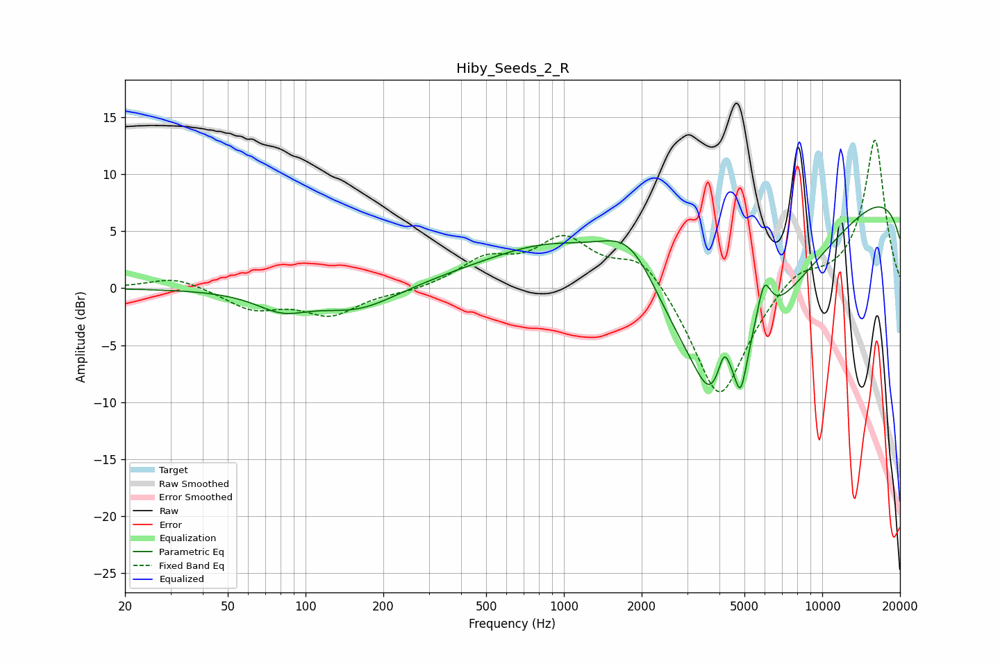

# Hiby_Seeds_2_R
See [usage instructions](https://github.com/jaakkopasanen/AutoEq#usage) for more options and info.

### Parametric EQs
Apply preamp of -7.2 dB when using parametric equalizer.

|   # | Type    |   Fc (Hz) |    Q |   Gain (dB) |
|-----|---------|-----------|------|-------------|
|   1 | Peaking |        81 | 1.4  |        -1.6 |
|   2 | Peaking |       160 | 0.9  |        -2.1 |
|   3 | Peaking |       928 | 0.46 |         8.4 |
|   4 | Peaking |      1821 | 1.05 |         6.9 |
|   5 | Peaking |      3697 | 2.48 |        -3.4 |
|   6 | Peaking |      3714 | 0.3  |       -19.9 |
|   7 | Peaking |      4171 | 5.98 |         2.6 |
|   8 | Peaking |      4834 | 6    |        -4   |
|   9 | Peaking |      5948 | 4.96 |         3.9 |
|  10 | Peaking |     10000 | 0.18 |        13.7 |

### Fixed Band EQs
When using fixed band (also called graphic) equalizer, apply preamp of **-13.1 dB** (if available) and set gains manually with these parameters.

|   # | Type    |   Fc (Hz) |    Q |   Gain (dB) |
|-----|---------|-----------|------|-------------|
|   1 | Peaking |        31 | 1.41 |         1   |
|   2 | Peaking |        62 | 1.41 |        -1.7 |
|   3 | Peaking |       125 | 1.41 |        -2.2 |
|   4 | Peaking |       250 | 1.41 |        -0.3 |
|   5 | Peaking |       500 | 1.41 |         2.3 |
|   6 | Peaking |      1000 | 1.41 |         4   |
|   7 | Peaking |      2000 | 1.41 |         3.1 |
|   8 | Peaking |      4000 | 1.41 |       -10.2 |
|   9 | Peaking |      8000 | 1.41 |         1.8 |
|  10 | Peaking |     16000 | 1.41 |        13.1 |

### Graphs

