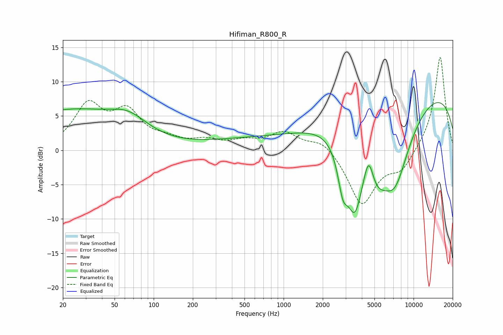

# Hifiman_R800_R
See [usage instructions](https://github.com/jaakkopasanen/AutoEq#usage) for more options and info.

### Parametric EQs
Apply preamp of -7.0 dB when using parametric equalizer.

|   # | Type    |   Fc (Hz) |    Q |   Gain (dB) |
|-----|---------|-----------|------|-------------|
|   1 | Peaking |        20 | 4.35 |         0   |
|   2 | Peaking |        22 | 0.34 |         5.6 |
|   3 | Peaking |        64 | 0.99 |         2.4 |
|   4 | Peaking |       544 | 0.4  |         1.3 |
|   5 | Peaking |      2856 | 3.61 |        -5.3 |
|   6 | Peaking |      3526 | 2.06 |       -10.7 |
|   7 | Peaking |      4509 | 3.7  |         4.7 |
|   8 | Peaking |      5123 | 1.63 |        -5.1 |
|   9 | Peaking |      7148 | 0.98 |       -12.2 |
|  10 | Peaking |      9653 | 0.18 |         9.7 |

### Fixed Band EQs
When using fixed band (also called graphic) equalizer, apply preamp of **-13.6 dB** (if available) and set gains manually with these parameters.

|   # | Type    |   Fc (Hz) |    Q |   Gain (dB) |
|-----|---------|-----------|------|-------------|
|   1 | Peaking |        31 | 1.41 |         6.2 |
|   2 | Peaking |        62 | 1.41 |         5   |
|   3 | Peaking |       125 | 1.41 |         1.1 |
|   4 | Peaking |       250 | 1.41 |         1.2 |
|   5 | Peaking |       500 | 1.41 |         1.1 |
|   6 | Peaking |      1000 | 1.41 |         2.5 |
|   7 | Peaking |      2000 | 1.41 |         1.7 |
|   8 | Peaking |      4000 | 1.41 |        -7.9 |
|   9 | Peaking |      8000 | 1.41 |        -2.7 |
|  10 | Peaking |     16000 | 1.41 |        13.8 |

### Graphs

