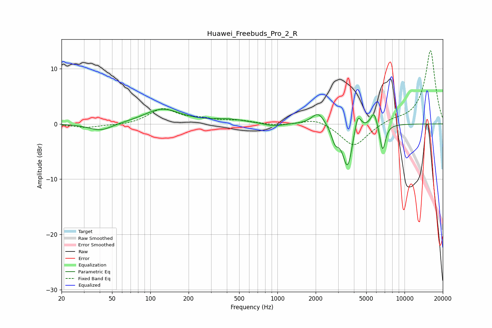

# Huawei_Freebuds_Pro_2_R
See [usage instructions](https://github.com/jaakkopasanen/AutoEq#usage) for more options and info.

### Parametric EQs
Apply preamp of -2.8 dB when using parametric equalizer.

|   # | Type    |   Fc (Hz) |    Q |   Gain (dB) |
|-----|---------|-----------|------|-------------|
|   1 | Peaking |        41 | 1.55 |        -1.4 |
|   2 | Peaking |       124 | 1    |         2.7 |
|   3 | Peaking |       413 | 1.08 |         0.7 |
|   4 | Peaking |       936 | 2.06 |        -0.5 |
|   5 | Peaking |      2096 | 2.79 |         2.3 |
|   6 | Peaking |      2841 | 5.02 |        -2.5 |
|   7 | Peaking |      3565 | 3.58 |        -8   |
|   8 | Peaking |      4277 | 5.32 |         3.6 |
|   9 | Peaking |      5749 | 5.24 |         2.8 |
|  10 | Peaking |      6726 | 6    |        -4.9 |

### Fixed Band EQs
When using fixed band (also called graphic) equalizer, apply preamp of **-13.3 dB** (if available) and set gains manually with these parameters.

|   # | Type    |   Fc (Hz) |    Q |   Gain (dB) |
|-----|---------|-----------|------|-------------|
|   1 | Peaking |        31 | 1.41 |        -0.7 |
|   2 | Peaking |        62 | 1.41 |        -0.3 |
|   3 | Peaking |       125 | 1.41 |         2.7 |
|   4 | Peaking |       250 | 1.41 |         0.7 |
|   5 | Peaking |       500 | 1.41 |         0.5 |
|   6 | Peaking |      1000 | 1.41 |        -0.3 |
|   7 | Peaking |      2000 | 1.41 |         1.1 |
|   8 | Peaking |      4000 | 1.41 |        -4.2 |
|   9 | Peaking |      8000 | 1.41 |         0.6 |
|  10 | Peaking |     16000 | 1.41 |        13.4 |

### Graphs

