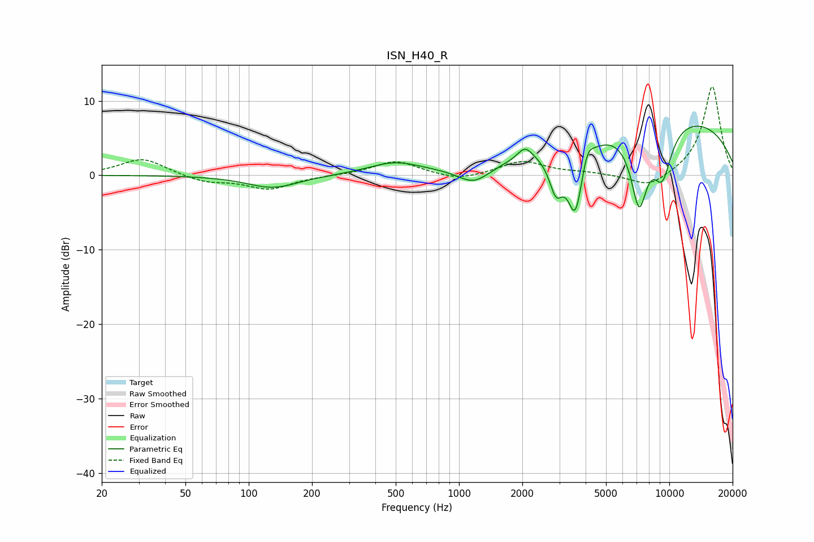

# ISN_H40_R
See [usage instructions](https://github.com/jaakkopasanen/AutoEq#usage) for more options and info.

### Parametric EQs
Apply preamp of -6.7 dB when using parametric equalizer.

|   # | Type    |   Fc (Hz) |    Q |   Gain (dB) |
|-----|---------|-----------|------|-------------|
|   1 | Peaking |       130 | 1.16 |        -1.7 |
|   2 | Peaking |       494 | 1.12 |         1.6 |
|   3 | Peaking |      1179 | 1.82 |        -2.3 |
|   4 | Peaking |      2059 | 4.15 |         1.7 |
|   5 | Peaking |      2891 | 4.26 |        -4.8 |
|   6 | Peaking |      3576 | 3.64 |        -9.5 |
|   7 | Peaking |      4067 | 5.12 |         2.4 |
|   8 | Peaking |      7182 | 3.24 |       -10.1 |
|   9 | Peaking |      9266 | 2.7  |        -6.7 |
|  10 | Peaking |      9461 | 0.23 |         8.1 |

### Fixed Band EQs
When using fixed band (also called graphic) equalizer, apply preamp of **-12.0 dB** (if available) and set gains manually with these parameters.

|   # | Type    |   Fc (Hz) |    Q |   Gain (dB) |
|-----|---------|-----------|------|-------------|
|   1 | Peaking |        31 | 1.41 |         2.3 |
|   2 | Peaking |        62 | 1.41 |        -0.9 |
|   3 | Peaking |       125 | 1.41 |        -1.8 |
|   4 | Peaking |       250 | 1.41 |        -0   |
|   5 | Peaking |       500 | 1.41 |         1.9 |
|   6 | Peaking |      1000 | 1.41 |        -0.8 |
|   7 | Peaking |      2000 | 1.41 |         1.9 |
|   8 | Peaking |      4000 | 1.41 |         0.3 |
|   9 | Peaking |      8000 | 1.41 |        -1.8 |
|  10 | Peaking |     16000 | 1.41 |        12.1 |

### Graphs

