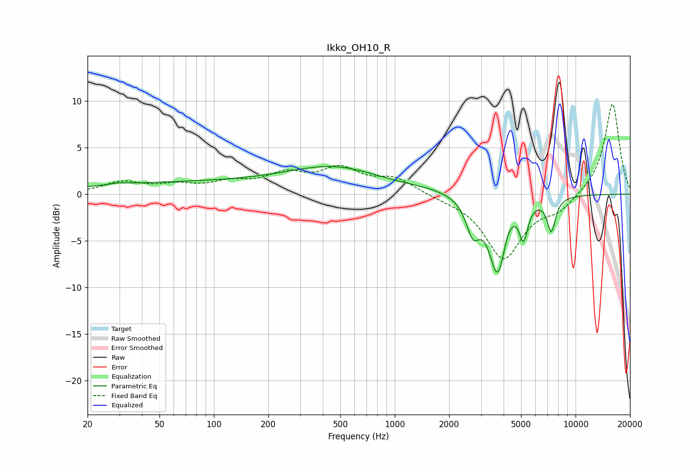

# Ikko_OH10_R
See [usage instructions](https://github.com/jaakkopasanen/AutoEq#usage) for more options and info.

### Parametric EQs
Apply preamp of -3.1 dB when using parametric equalizer.

|   # | Type    |   Fc (Hz) |    Q |   Gain (dB) |
|-----|---------|-----------|------|-------------|
|   1 | Peaking |        30 | 3.12 |         0.2 |
|   2 | Peaking |        91 | 0.18 |         1.3 |
|   3 | Peaking |       482 | 0.57 |         2.2 |
|   4 | Peaking |      1559 | 0.94 |         0.3 |
|   5 | Peaking |      2705 | 3.81 |        -3.4 |
|   6 | Peaking |      3712 | 2.9  |        -8.3 |
|   7 | Peaking |      4199 | 5.15 |         1   |
|   8 | Peaking |      4669 | 4.21 |         0.4 |
|   9 | Peaking |      5156 | 6    |        -3.6 |
|  10 | Peaking |      7346 | 5.75 |        -3.6 |

### Fixed Band EQs
When using fixed band (also called graphic) equalizer, apply preamp of **-9.7 dB** (if available) and set gains manually with these parameters.

|   # | Type    |   Fc (Hz) |    Q |   Gain (dB) |
|-----|---------|-----------|------|-------------|
|   1 | Peaking |        31 | 1.41 |         1.2 |
|   2 | Peaking |        62 | 1.41 |         0.8 |
|   3 | Peaking |       125 | 1.41 |         1   |
|   4 | Peaking |       250 | 1.41 |         1.9 |
|   5 | Peaking |       500 | 1.41 |         2.5 |
|   6 | Peaking |      1000 | 1.41 |         1.6 |
|   7 | Peaking |      2000 | 1.41 |        -0.3 |
|   8 | Peaking |      4000 | 1.41 |        -6.8 |
|   9 | Peaking |      8000 | 1.41 |        -1.5 |
|  10 | Peaking |     16000 | 1.41 |         9.8 |

### Graphs

