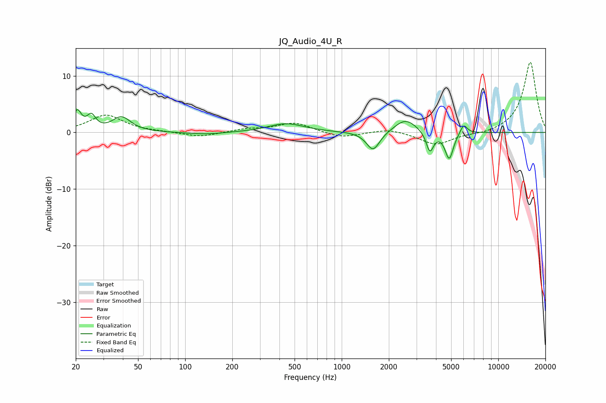

# JQ_Audio_4U_R
See [usage instructions](https://github.com/jaakkopasanen/AutoEq#usage) for more options and info.

### Parametric EQs
Apply preamp of -4.1 dB when using parametric equalizer.

|   # | Type    |   Fc (Hz) |    Q |   Gain (dB) |
|-----|---------|-----------|------|-------------|
|   1 | Peaking |        20 | 5.56 |         3.4 |
|   2 | Peaking |        25 | 5.18 |         2.4 |
|   3 | Peaking |        39 | 2.4  |         2.6 |
|   4 | Peaking |       135 | 1.21 |        -0.4 |
|   5 | Peaking |       442 | 1.24 |         1.6 |
|   6 | Peaking |      1586 | 3.32 |        -3.4 |
|   7 | Peaking |      2559 | 2.02 |         2.4 |
|   8 | Peaking |      3658 | 6    |        -3.6 |
|   9 | Peaking |      4861 | 5.32 |        -4.7 |
|  10 | Peaking |      6008 | 6    |         1.7 |

### Fixed Band EQs
When using fixed band (also called graphic) equalizer, apply preamp of **-12.5 dB** (if available) and set gains manually with these parameters.

|   # | Type    |   Fc (Hz) |    Q |   Gain (dB) |
|-----|---------|-----------|------|-------------|
|   1 | Peaking |        31 | 1.41 |         3.1 |
|   2 | Peaking |        62 | 1.41 |         0.1 |
|   3 | Peaking |       125 | 1.41 |        -0.8 |
|   4 | Peaking |       250 | 1.41 |         0.6 |
|   5 | Peaking |       500 | 1.41 |         1.7 |
|   6 | Peaking |      1000 | 1.41 |        -1   |
|   7 | Peaking |      2000 | 1.41 |         0.7 |
|   8 | Peaking |      4000 | 1.41 |        -2.2 |
|   9 | Peaking |      8000 | 1.41 |        -0.4 |
|  10 | Peaking |     16000 | 1.41 |        12.5 |

### Graphs

