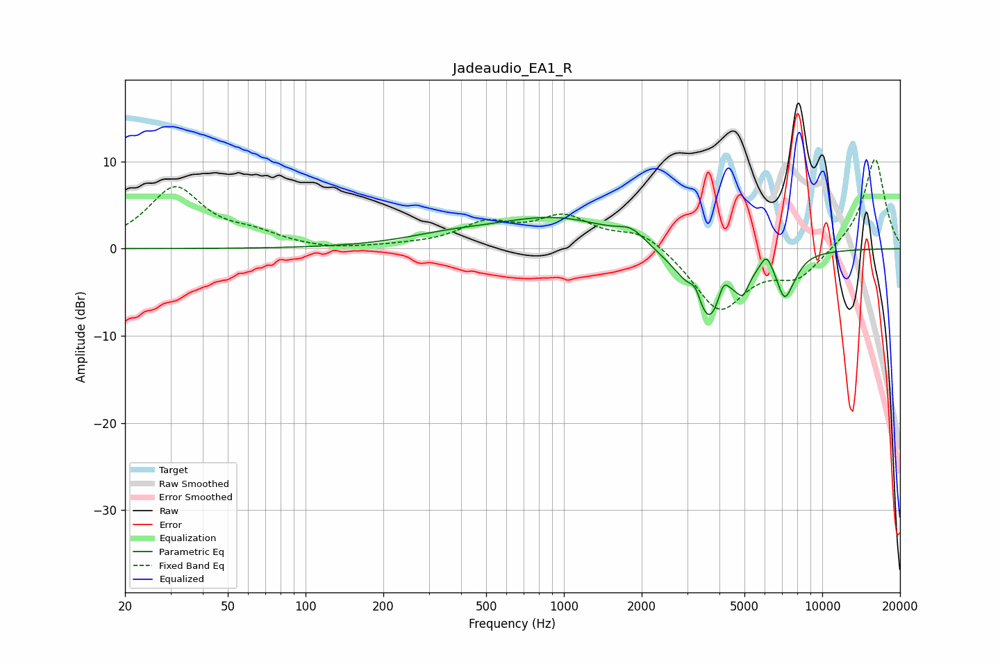

# Jadeaudio_EA1_R
See [usage instructions](https://github.com/jaakkopasanen/AutoEq#usage) for more options and info.

### Parametric EQs
Apply preamp of -3.7 dB when using parametric equalizer.

|   # | Type    |   Fc (Hz) |    Q |   Gain (dB) |
|-----|---------|-----------|------|-------------|
|   1 | Peaking |       354 | 0.8  |         0.9 |
|   2 | Peaking |       942 | 0.58 |         3.5 |
|   3 | Peaking |      1827 | 2.69 |         1.4 |
|   4 | Peaking |      3232 | 6    |         2.1 |
|   5 | Peaking |      3638 | 1.81 |        -9.5 |
|   6 | Peaking |      4143 | 6    |         2.8 |
|   7 | Peaking |      4929 | 5.98 |        -2.1 |
|   8 | Peaking |      6084 | 6    |         1.9 |
|   9 | Peaking |      7134 | 4.51 |        -4.1 |
|  10 | Peaking |      7725 | 3.66 |        -1.1 |

### Fixed Band EQs
When using fixed band (also called graphic) equalizer, apply preamp of **-10.3 dB** (if available) and set gains manually with these parameters.

|   # | Type    |   Fc (Hz) |    Q |   Gain (dB) |
|-----|---------|-----------|------|-------------|
|   1 | Peaking |        31 | 1.41 |         6.9 |
|   2 | Peaking |        62 | 1.41 |         1.3 |
|   3 | Peaking |       125 | 1.41 |        -0.3 |
|   4 | Peaking |       250 | 1.41 |         0.2 |
|   5 | Peaking |       500 | 1.41 |         2.6 |
|   6 | Peaking |      1000 | 1.41 |         3.4 |
|   7 | Peaking |      2000 | 1.41 |         2.1 |
|   8 | Peaking |      4000 | 1.41 |        -7.1 |
|   9 | Peaking |      8000 | 1.41 |        -3.1 |
|  10 | Peaking |     16000 | 1.41 |        10.5 |

### Graphs

