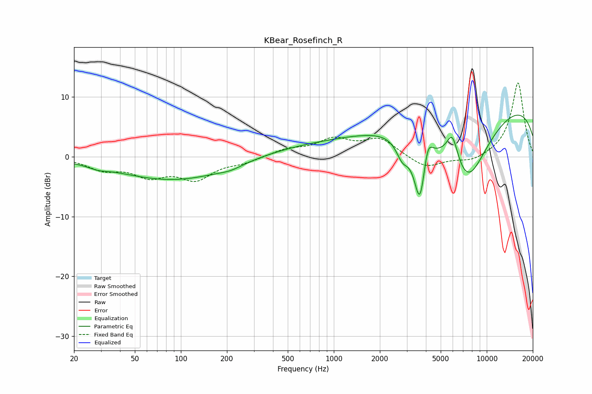

# KBear_Rosefinch_R
See [usage instructions](https://github.com/jaakkopasanen/AutoEq#usage) for more options and info.

### Parametric EQs
Apply preamp of -7.1 dB when using parametric equalizer.

|   # | Type    |   Fc (Hz) |    Q |   Gain (dB) |
|-----|---------|-----------|------|-------------|
|   1 | Peaking |        29 | 2.46 |        -0.5 |
|   2 | Peaking |       105 | 0.35 |        -4.4 |
|   3 | Peaking |       211 | 1.92 |        -0.6 |
|   4 | Peaking |       518 | 0.28 |         2.1 |
|   5 | Peaking |      2808 | 3.41 |        -3.1 |
|   6 | Peaking |      3656 | 3.48 |       -11.1 |
|   7 | Peaking |      4110 | 4.78 |         4   |
|   8 | Peaking |      5957 | 3.66 |         4.8 |
|   9 | Peaking |      7458 | 0.84 |       -13.4 |
|  10 | Peaking |      9985 | 0.18 |        10.4 |

### Fixed Band EQs
When using fixed band (also called graphic) equalizer, apply preamp of **-12.4 dB** (if available) and set gains manually with these parameters.

|   # | Type    |   Fc (Hz) |    Q |   Gain (dB) |
|-----|---------|-----------|------|-------------|
|   1 | Peaking |        31 | 1.41 |        -1.9 |
|   2 | Peaking |        62 | 1.41 |        -2.8 |
|   3 | Peaking |       125 | 1.41 |        -3.5 |
|   4 | Peaking |       250 | 1.41 |        -0.8 |
|   5 | Peaking |       500 | 1.41 |         1.2 |
|   6 | Peaking |      1000 | 1.41 |         2.7 |
|   7 | Peaking |      2000 | 1.41 |         2.9 |
|   8 | Peaking |      4000 | 1.41 |        -2   |
|   9 | Peaking |      8000 | 1.41 |        -1   |
|  10 | Peaking |     16000 | 1.41 |        12.5 |

### Graphs

