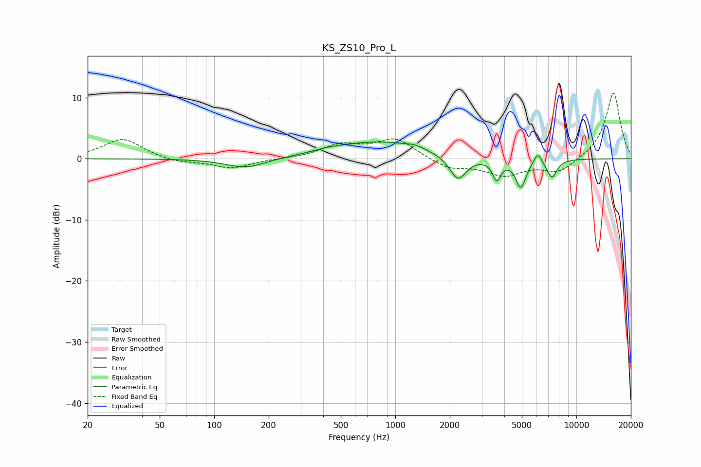

# KS_ZS10_Pro_L
See [usage instructions](https://github.com/jaakkopasanen/AutoEq#usage) for more options and info.

### Parametric EQs
Apply preamp of -2.9 dB when using parametric equalizer.

|   # | Type    |   Fc (Hz) |    Q |   Gain (dB) |
|-----|---------|-----------|------|-------------|
|   1 | Peaking |       149 | 1.29 |        -1.6 |
|   2 | Peaking |       426 | 1.67 |         0.4 |
|   3 | Peaking |       804 | 0.58 |         2.7 |
|   4 | Peaking |      1276 | 2.72 |         0.5 |
|   5 | Peaking |      2219 | 3.07 |        -4   |
|   6 | Peaking |      3633 | 6    |        -3.2 |
|   7 | Peaking |      4937 | 4.88 |        -4.6 |
|   8 | Peaking |      6139 | 5.96 |         2   |
|   9 | Peaking |      6800 | 3.36 |        -0.4 |
|  10 | Peaking |      7344 | 5.08 |        -2.7 |

### Fixed Band EQs
When using fixed band (also called graphic) equalizer, apply preamp of **-10.8 dB** (if available) and set gains manually with these parameters.

|   # | Type    |   Fc (Hz) |    Q |   Gain (dB) |
|-----|---------|-----------|------|-------------|
|   1 | Peaking |        31 | 1.41 |         3.3 |
|   2 | Peaking |        62 | 1.41 |        -0.7 |
|   3 | Peaking |       125 | 1.41 |        -1.5 |
|   4 | Peaking |       250 | 1.41 |        -0   |
|   5 | Peaking |       500 | 1.41 |         2.1 |
|   6 | Peaking |      1000 | 1.41 |         3.2 |
|   7 | Peaking |      2000 | 1.41 |        -1.6 |
|   8 | Peaking |      4000 | 1.41 |        -2.5 |
|   9 | Peaking |      8000 | 1.41 |        -2.3 |
|  10 | Peaking |     16000 | 1.41 |        10.9 |

### Graphs

