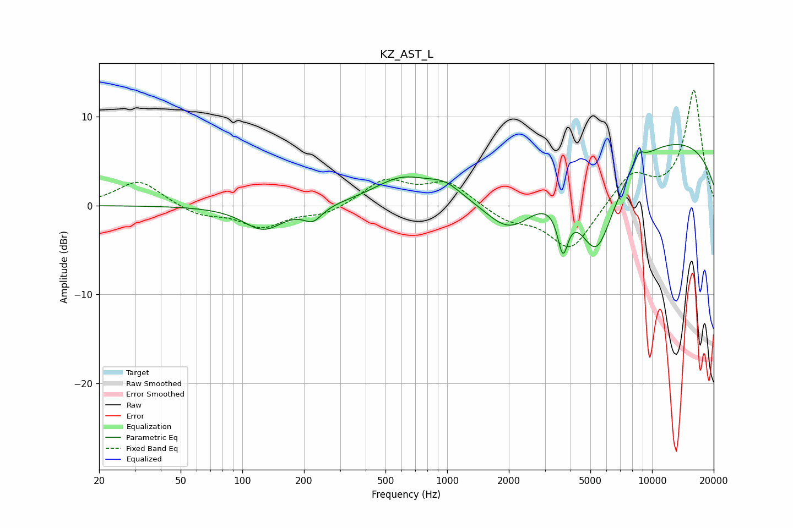

# KZ_AST_L
See [usage instructions](https://github.com/jaakkopasanen/AutoEq#usage) for more options and info.

### Parametric EQs
Apply preamp of -7.0 dB when using parametric equalizer.

|   # | Type    |   Fc (Hz) |    Q |   Gain (dB) |
|-----|---------|-----------|------|-------------|
|   1 | Peaking |       127 | 1.46 |        -2.7 |
|   2 | Peaking |       221 | 3.11 |        -1.6 |
|   3 | Peaking |       601 | 1.02 |         2.8 |
|   4 | Peaking |       974 | 1.76 |         1.4 |
|   5 | Peaking |      1769 | 2.07 |        -0   |
|   6 | Peaking |      2034 | 1.09 |        -5.2 |
|   7 | Peaking |      3672 | 5.42 |        -5.1 |
|   8 | Peaking |      5359 | 1.38 |       -11   |
|   9 | Peaking |      8644 | 4.94 |         1.3 |
|  10 | Peaking |      9490 | 0.19 |         8   |

### Fixed Band EQs
When using fixed band (also called graphic) equalizer, apply preamp of **-13.0 dB** (if available) and set gains manually with these parameters.

|   # | Type    |   Fc (Hz) |    Q |   Gain (dB) |
|-----|---------|-----------|------|-------------|
|   1 | Peaking |        31 | 1.41 |         2.9 |
|   2 | Peaking |        62 | 1.41 |        -1.1 |
|   3 | Peaking |       125 | 1.41 |        -2.3 |
|   4 | Peaking |       250 | 1.41 |        -1   |
|   5 | Peaking |       500 | 1.41 |         2.8 |
|   6 | Peaking |      1000 | 1.41 |         2.6 |
|   7 | Peaking |      2000 | 1.41 |        -1.6 |
|   8 | Peaking |      4000 | 1.41 |        -5.1 |
|   9 | Peaking |      8000 | 1.41 |         3.5 |
|  10 | Peaking |     16000 | 1.41 |        12.9 |

### Graphs

