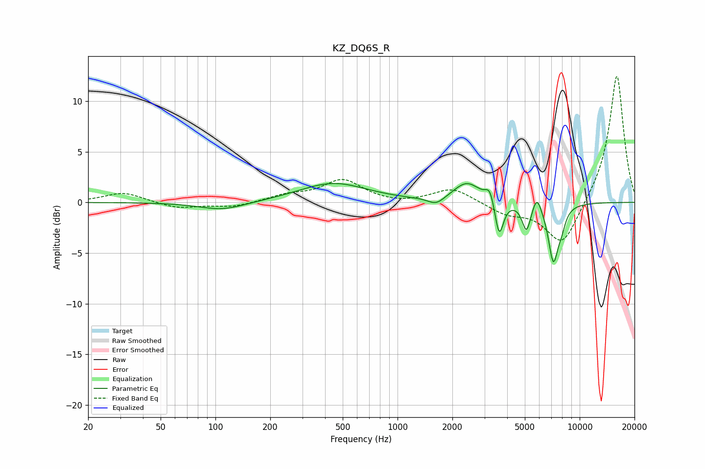

# KZ_DQ6S_R
See [usage instructions](https://github.com/jaakkopasanen/AutoEq#usage) for more options and info.

### Parametric EQs
Apply preamp of -2.0 dB when using parametric equalizer.

|   # | Type    |   Fc (Hz) |    Q |   Gain (dB) |
|-----|---------|-----------|------|-------------|
|   1 | Peaking |       109 | 1.12 |        -0.8 |
|   2 | Peaking |       444 | 0.76 |         1.9 |
|   3 | Peaking |      1630 | 3.12 |        -0.8 |
|   4 | Peaking |      2405 | 1.93 |         1.9 |
|   5 | Peaking |      3214 | 6    |         1.4 |
|   6 | Peaking |      3614 | 6    |        -3.7 |
|   7 | Peaking |      5101 | 6    |        -2.7 |
|   8 | Peaking |      5826 | 5.97 |         1.6 |
|   9 | Peaking |      7172 | 4.84 |        -5.6 |
|  10 | Peaking |      7958 | 6    |        -1.2 |

### Fixed Band EQs
When using fixed band (also called graphic) equalizer, apply preamp of **-12.5 dB** (if available) and set gains manually with these parameters.

|   # | Type    |   Fc (Hz) |    Q |   Gain (dB) |
|-----|---------|-----------|------|-------------|
|   1 | Peaking |        31 | 1.41 |         1   |
|   2 | Peaking |        62 | 1.41 |        -0.6 |
|   3 | Peaking |       125 | 1.41 |        -0.5 |
|   4 | Peaking |       250 | 1.41 |         0.6 |
|   5 | Peaking |       500 | 1.41 |         2.2 |
|   6 | Peaking |      1000 | 1.41 |        -0.2 |
|   7 | Peaking |      2000 | 1.41 |         1.4 |
|   8 | Peaking |      4000 | 1.41 |        -1.1 |
|   9 | Peaking |      8000 | 1.41 |        -4.4 |
|  10 | Peaking |     16000 | 1.41 |        12.8 |

### Graphs

