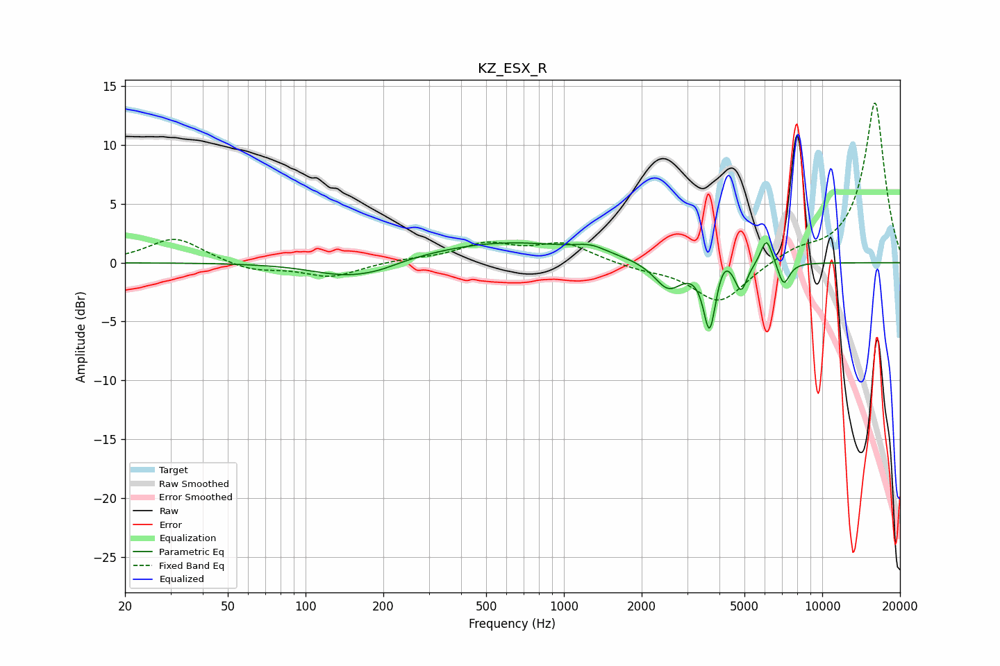

# KZ_ESX_R
See [usage instructions](https://github.com/jaakkopasanen/AutoEq#usage) for more options and info.

### Parametric EQs
Apply preamp of -1.8 dB when using parametric equalizer.

|   # | Type    |   Fc (Hz) |    Q |   Gain (dB) |
|-----|---------|-----------|------|-------------|
|   1 | Peaking |       147 | 1    |        -1.3 |
|   2 | Peaking |       194 | 1.95 |        -0.3 |
|   3 | Peaking |       596 | 0.47 |         1.8 |
|   4 | Peaking |      1269 | 2.32 |         0.6 |
|   5 | Peaking |      2535 | 2.58 |        -2.4 |
|   6 | Peaking |      3664 | 6    |        -5.7 |
|   7 | Peaking |      4170 | 4.7  |         1.3 |
|   8 | Peaking |      4849 | 6    |        -2.4 |
|   9 | Peaking |      6090 | 5.96 |         2.4 |
|  10 | Peaking |      7089 | 6    |        -2   |

### Fixed Band EQs
When using fixed band (also called graphic) equalizer, apply preamp of **-13.7 dB** (if available) and set gains manually with these parameters.

|   # | Type    |   Fc (Hz) |    Q |   Gain (dB) |
|-----|---------|-----------|------|-------------|
|   1 | Peaking |        31 | 1.41 |         2.1 |
|   2 | Peaking |        62 | 1.41 |        -0.7 |
|   3 | Peaking |       125 | 1.41 |        -1.2 |
|   4 | Peaking |       250 | 1.41 |         0.2 |
|   5 | Peaking |       500 | 1.41 |         1.5 |
|   6 | Peaking |      1000 | 1.41 |         1.6 |
|   7 | Peaking |      2000 | 1.41 |        -0.5 |
|   8 | Peaking |      4000 | 1.41 |        -3.5 |
|   9 | Peaking |      8000 | 1.41 |         0.9 |
|  10 | Peaking |     16000 | 1.41 |        13.7 |

### Graphs

