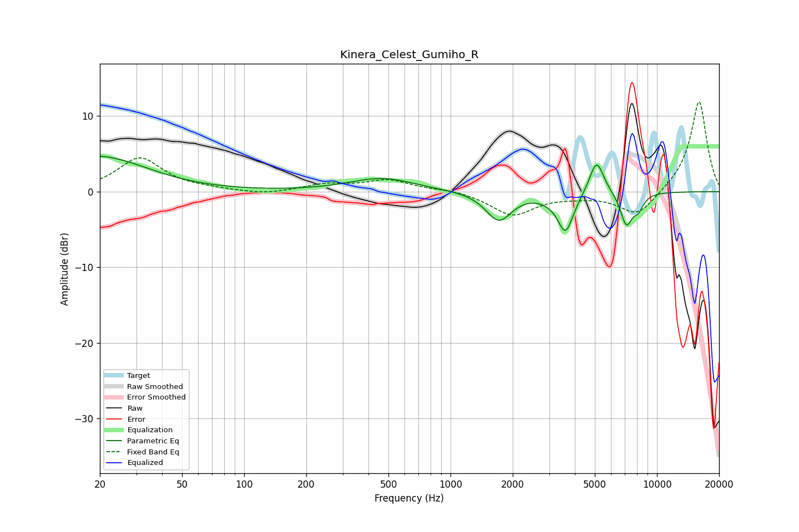

# Kinera_Celest_Gumiho_R
See [usage instructions](https://github.com/jaakkopasanen/AutoEq#usage) for more options and info.

### Parametric EQs
Apply preamp of -4.8 dB when using parametric equalizer.

|   # | Type    |   Fc (Hz) |    Q |   Gain (dB) |
|-----|---------|-----------|------|-------------|
|   1 | Peaking |        20 | 0.68 |         5.2 |
|   2 | Peaking |        23 | 1.26 |        -0.6 |
|   3 | Peaking |       466 | 0.89 |         1.8 |
|   4 | Peaking |      1713 | 2.26 |        -3.8 |
|   5 | Peaking |      2939 | 2.91 |        -0.3 |
|   6 | Peaking |      3611 | 3.6  |        -5.3 |
|   7 | Peaking |      3809 | 5.35 |         0.1 |
|   8 | Peaking |      5100 | 3.92 |         4.6 |
|   9 | Peaking |      7107 | 4.64 |        -4.2 |
|  10 | Peaking |      8116 | 5.02 |        -1.7 |

### Fixed Band EQs
When using fixed band (also called graphic) equalizer, apply preamp of **-12.0 dB** (if available) and set gains manually with these parameters.

|   # | Type    |   Fc (Hz) |    Q |   Gain (dB) |
|-----|---------|-----------|------|-------------|
|   1 | Peaking |        31 | 1.41 |         4.4 |
|   2 | Peaking |        62 | 1.41 |         0.2 |
|   3 | Peaking |       125 | 1.41 |        -0.4 |
|   4 | Peaking |       250 | 1.41 |         0.9 |
|   5 | Peaking |       500 | 1.41 |         1.5 |
|   6 | Peaking |      1000 | 1.41 |         0.3 |
|   7 | Peaking |      2000 | 1.41 |        -3.1 |
|   8 | Peaking |      4000 | 1.41 |        -0.4 |
|   9 | Peaking |      8000 | 1.41 |        -3.3 |
|  10 | Peaking |     16000 | 1.41 |        12.1 |

### Graphs

