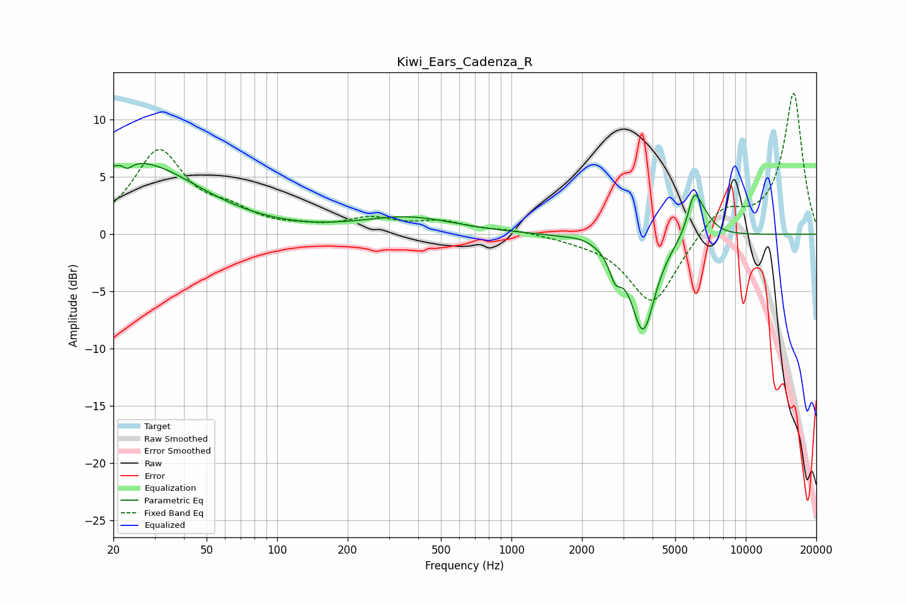

# Kiwi_Ears_Cadenza_R
See [usage instructions](https://github.com/jaakkopasanen/AutoEq#usage) for more options and info.

### Parametric EQs
Apply preamp of -6.3 dB when using parametric equalizer.

|   # | Type    |   Fc (Hz) |    Q |   Gain (dB) |
|-----|---------|-----------|------|-------------|
|   1 | Peaking |        22 | 5.73 |         3.1 |
|   2 | Peaking |        23 | 5.94 |        -3.6 |
|   3 | Peaking |        23 | 0.45 |         1.5 |
|   4 | Peaking |        25 | 0.57 |         4.8 |
|   5 | Peaking |       360 | 0.7  |         1.4 |
|   6 | Peaking |      1979 | 3.46 |         0.2 |
|   7 | Peaking |      2773 | 5.4  |        -2   |
|   8 | Peaking |      3647 | 2.72 |        -8.3 |
|   9 | Peaking |      6003 | 5.06 |         2.9 |
|  10 | Peaking |      6509 | 2.94 |         1.8 |

### Fixed Band EQs
When using fixed band (also called graphic) equalizer, apply preamp of **-12.4 dB** (if available) and set gains manually with these parameters.

|   # | Type    |   Fc (Hz) |    Q |   Gain (dB) |
|-----|---------|-----------|------|-------------|
|   1 | Peaking |        31 | 1.41 |         7.1 |
|   2 | Peaking |        62 | 1.41 |         1.5 |
|   3 | Peaking |       125 | 1.41 |         0.3 |
|   4 | Peaking |       250 | 1.41 |         1.2 |
|   5 | Peaking |       500 | 1.41 |         1   |
|   6 | Peaking |      1000 | 1.41 |         0.4 |
|   7 | Peaking |      2000 | 1.41 |        -0.3 |
|   8 | Peaking |      4000 | 1.41 |        -6.2 |
|   9 | Peaking |      8000 | 1.41 |         2.3 |
|  10 | Peaking |     16000 | 1.41 |        12.3 |

### Graphs

