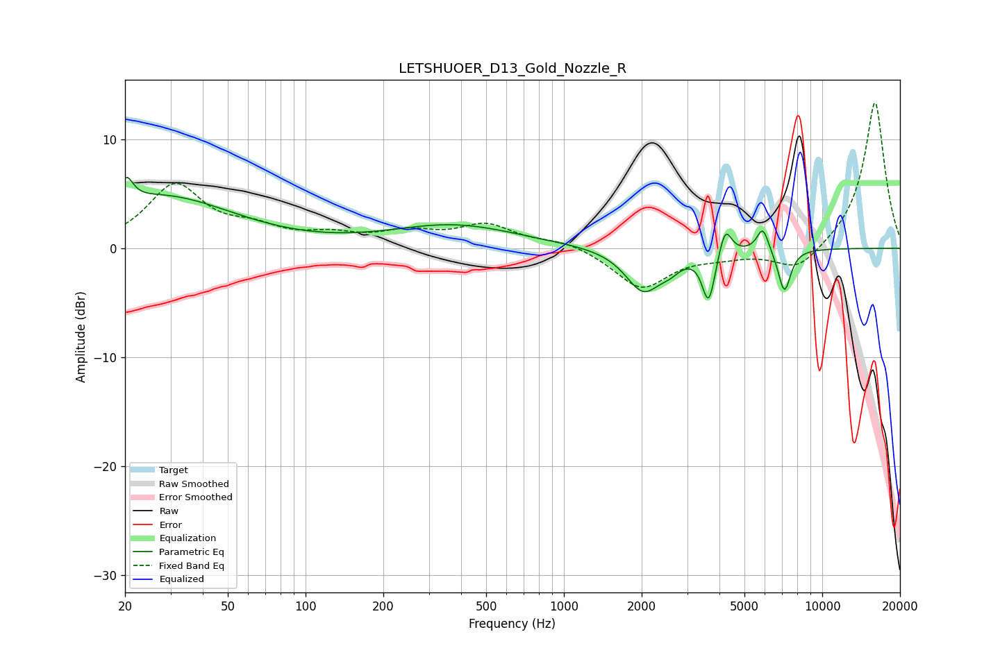

# LETSHUOER_D13_Gold_Nozzle_R
See [usage instructions](https://github.com/jaakkopasanen/AutoEq#usage) for more options and info.

### Parametric EQs
Apply preamp of -6.6 dB when using parametric equalizer.

|   # | Type    |   Fc (Hz) |    Q |   Gain (dB) |
|-----|---------|-----------|------|-------------|
|   1 | Peaking |        20 | 5.63 |         2.2 |
|   2 | Peaking |        28 | 0.51 |         4.7 |
|   3 | Peaking |       376 | 0.57 |         2.1 |
|   4 | Peaking |      2028 | 2.07 |        -3.9 |
|   5 | Peaking |      2575 | 3.38 |        -0.9 |
|   6 | Peaking |      3542 | 6    |        -0.9 |
|   7 | Peaking |      3653 | 6    |        -3.8 |
|   8 | Peaking |      4213 | 5.93 |         2.6 |
|   9 | Peaking |      5888 | 6    |         2.2 |
|  10 | Peaking |      7137 | 5.52 |        -4   |

### Fixed Band EQs
When using fixed band (also called graphic) equalizer, apply preamp of **-13.4 dB** (if available) and set gains manually with these parameters.

|   # | Type    |   Fc (Hz) |    Q |   Gain (dB) |
|-----|---------|-----------|------|-------------|
|   1 | Peaking |        31 | 1.41 |         5.7 |
|   2 | Peaking |        62 | 1.41 |         1.4 |
|   3 | Peaking |       125 | 1.41 |         1   |
|   4 | Peaking |       250 | 1.41 |         1.3 |
|   5 | Peaking |       500 | 1.41 |         2   |
|   6 | Peaking |      1000 | 1.41 |         0.7 |
|   7 | Peaking |      2000 | 1.41 |        -3.7 |
|   8 | Peaking |      4000 | 1.41 |        -0.6 |
|   9 | Peaking |      8000 | 1.41 |        -2.2 |
|  10 | Peaking |     16000 | 1.41 |        13.6 |

### Graphs

