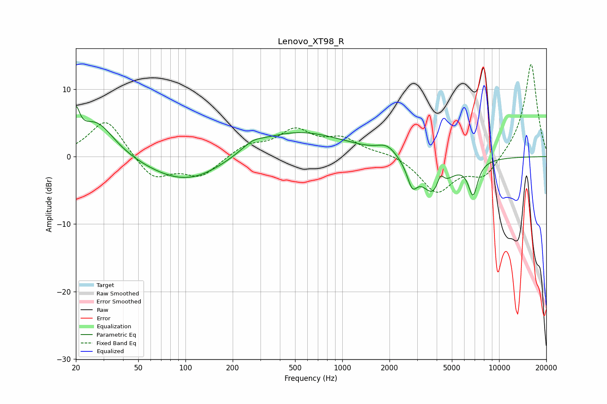

# Lenovo_XT98_R
See [usage instructions](https://github.com/jaakkopasanen/AutoEq#usage) for more options and info.

### Parametric EQs
Apply preamp of -7.5 dB when using parametric equalizer.

|   # | Type    |   Fc (Hz) |    Q |   Gain (dB) |
|-----|---------|-----------|------|-------------|
|   1 | Peaking |        20 | 5.99 |         4.3 |
|   2 | Peaking |        27 | 1.21 |         5.5 |
|   3 | Peaking |       105 | 0.56 |        -4.2 |
|   4 | Peaking |       268 | 2.15 |         1   |
|   5 | Peaking |       487 | 0.44 |         4   |
|   6 | Peaking |      1936 | 2.33 |         1.5 |
|   7 | Peaking |      2794 | 4.39 |        -3.2 |
|   8 | Peaking |      3884 | 1.72 |        -5.9 |
|   9 | Peaking |      4220 | 5.78 |         2.5 |
|  10 | Peaking |      6824 | 4.46 |        -4.8 |

### Fixed Band EQs
When using fixed band (also called graphic) equalizer, apply preamp of **-13.8 dB** (if available) and set gains manually with these parameters.

|   # | Type    |   Fc (Hz) |    Q |   Gain (dB) |
|-----|---------|-----------|------|-------------|
|   1 | Peaking |        31 | 1.41 |         5.7 |
|   2 | Peaking |        62 | 1.41 |        -3.5 |
|   3 | Peaking |       125 | 1.41 |        -2.9 |
|   4 | Peaking |       250 | 1.41 |         1.7 |
|   5 | Peaking |       500 | 1.41 |         3.7 |
|   6 | Peaking |      1000 | 1.41 |         2.4 |
|   7 | Peaking |      2000 | 1.41 |         0.6 |
|   8 | Peaking |      4000 | 1.41 |        -5.2 |
|   9 | Peaking |      8000 | 1.41 |        -3.1 |
|  10 | Peaking |     16000 | 1.41 |        14   |

### Graphs

