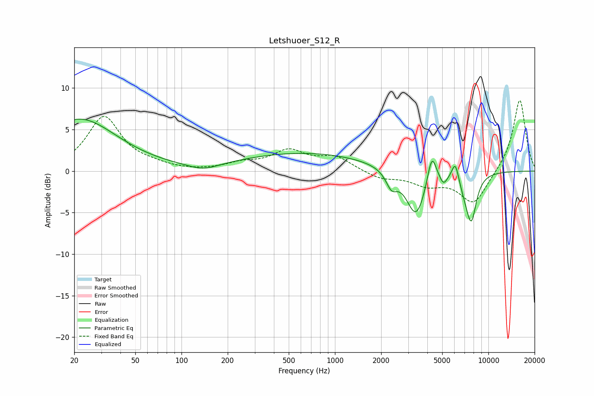

# Letshuoer_S12_R
See [usage instructions](https://github.com/jaakkopasanen/AutoEq#usage) for more options and info.

### Parametric EQs
Apply preamp of -6.3 dB when using parametric equalizer.

|   # | Type    |   Fc (Hz) |    Q |   Gain (dB) |
|-----|---------|-----------|------|-------------|
|   1 | Peaking |        22 | 0.58 |         6.2 |
|   2 | Peaking |       139 | 1.42 |        -0.8 |
|   3 | Peaking |       642 | 0.33 |         2.2 |
|   4 | Peaking |      2337 | 3.9  |        -1.9 |
|   5 | Peaking |      3378 | 2.22 |        -5.7 |
|   6 | Peaking |      4279 | 4.81 |         3.7 |
|   7 | Peaking |      5099 | 5.98 |        -1.1 |
|   8 | Peaking |      6089 | 5.96 |         2.4 |
|   9 | Peaking |      7036 | 3.16 |        -1.4 |
|  10 | Peaking |      7745 | 4.03 |        -5.2 |

### Fixed Band EQs
When using fixed band (also called graphic) equalizer, apply preamp of **-8.6 dB** (if available) and set gains manually with these parameters.

|   # | Type    |   Fc (Hz) |    Q |   Gain (dB) |
|-----|---------|-----------|------|-------------|
|   1 | Peaking |        31 | 1.41 |         6.5 |
|   2 | Peaking |        62 | 1.41 |         0.5 |
|   3 | Peaking |       125 | 1.41 |        -0.1 |
|   4 | Peaking |       250 | 1.41 |         0.8 |
|   5 | Peaking |       500 | 1.41 |         2.3 |
|   6 | Peaking |      1000 | 1.41 |         1.6 |
|   7 | Peaking |      2000 | 1.41 |        -0.9 |
|   8 | Peaking |      4000 | 1.41 |        -1.5 |
|   9 | Peaking |      8000 | 1.41 |        -4   |
|  10 | Peaking |     16000 | 1.41 |         8.8 |

### Graphs

