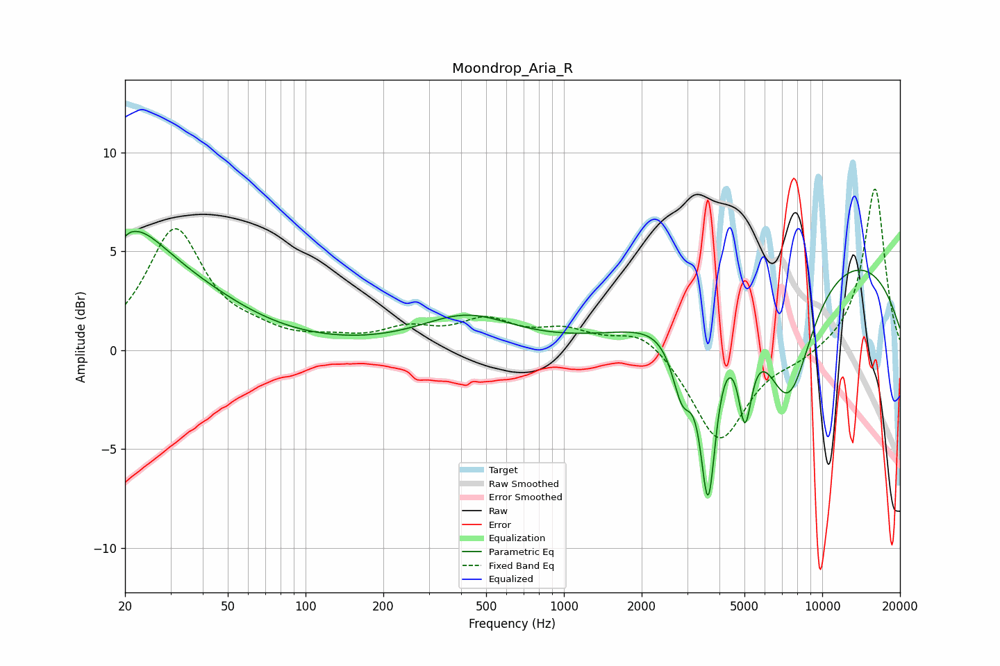

# Moondrop_Aria_R
See [usage instructions](https://github.com/jaakkopasanen/AutoEq#usage) for more options and info.

### Parametric EQs
Apply preamp of -6.1 dB when using parametric equalizer.

|   # | Type    |   Fc (Hz) |    Q |   Gain (dB) |
|-----|---------|-----------|------|-------------|
|   1 | Peaking |        20 | 0.89 |         5.2 |
|   2 | Peaking |        20 | 5.62 |        -3.8 |
|   3 | Peaking |        20 | 5.85 |         3.3 |
|   4 | Peaking |        38 | 0.61 |         1.7 |
|   5 | Peaking |       420 | 0.79 |         1.6 |
|   6 | Peaking |      2876 | 3.44 |        -3.3 |
|   7 | Peaking |      3617 | 4.68 |        -8.6 |
|   8 | Peaking |      5023 | 5.28 |        -4.4 |
|   9 | Peaking |      7396 | 1.41 |        -6.7 |
|  10 | Peaking |     10000 | 0.25 |         5.2 |

### Fixed Band EQs
When using fixed band (also called graphic) equalizer, apply preamp of **-8.3 dB** (if available) and set gains manually with these parameters.

|   # | Type    |   Fc (Hz) |    Q |   Gain (dB) |
|-----|---------|-----------|------|-------------|
|   1 | Peaking |        31 | 1.41 |         6   |
|   2 | Peaking |        62 | 1.41 |         0.5 |
|   3 | Peaking |       125 | 1.41 |         0.4 |
|   4 | Peaking |       250 | 1.41 |         0.9 |
|   5 | Peaking |       500 | 1.41 |         1.3 |
|   6 | Peaking |      1000 | 1.41 |         0.9 |
|   7 | Peaking |      2000 | 1.41 |         1.1 |
|   8 | Peaking |      4000 | 1.41 |        -4.7 |
|   9 | Peaking |      8000 | 1.41 |        -0.4 |
|  10 | Peaking |     16000 | 1.41 |         8.3 |

### Graphs

