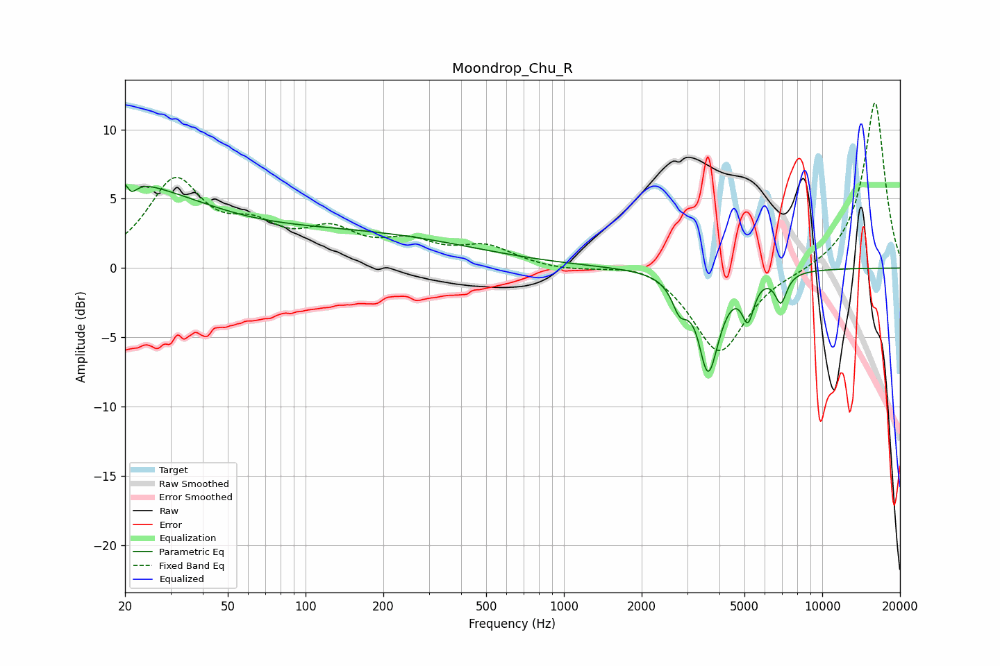

# Moondrop_Chu_R
See [usage instructions](https://github.com/jaakkopasanen/AutoEq#usage) for more options and info.

### Parametric EQs
Apply preamp of -6.1 dB when using parametric equalizer.

|   # | Type    |   Fc (Hz) |    Q |   Gain (dB) |
|-----|---------|-----------|------|-------------|
|   1 | Peaking |        20 | 0.5  |         5.9 |
|   2 | Peaking |        21 | 5.82 |         3.3 |
|   3 | Peaking |        21 | 5.96 |        -3.8 |
|   4 | Peaking |        29 | 1.49 |        -0.2 |
|   5 | Peaking |       155 | 0.31 |         2.3 |
|   6 | Peaking |      2801 | 5.03 |        -1.7 |
|   7 | Peaking |      3322 | 4.7  |         1   |
|   8 | Peaking |      3596 | 3.25 |        -7.8 |
|   9 | Peaking |      5159 | 6    |        -2.8 |
|  10 | Peaking |      6920 | 6    |        -2.1 |

### Fixed Band EQs
When using fixed band (also called graphic) equalizer, apply preamp of **-12.0 dB** (if available) and set gains manually with these parameters.

|   # | Type    |   Fc (Hz) |    Q |   Gain (dB) |
|-----|---------|-----------|------|-------------|
|   1 | Peaking |        31 | 1.41 |         6   |
|   2 | Peaking |        62 | 1.41 |         2.2 |
|   3 | Peaking |       125 | 1.41 |         2.2 |
|   4 | Peaking |       250 | 1.41 |         1.5 |
|   5 | Peaking |       500 | 1.41 |         1.4 |
|   6 | Peaking |      1000 | 1.41 |        -0.2 |
|   7 | Peaking |      2000 | 1.41 |         0.6 |
|   8 | Peaking |      4000 | 1.41 |        -6.2 |
|   9 | Peaking |      8000 | 1.41 |        -0.2 |
|  10 | Peaking |     16000 | 1.41 |        12.1 |

### Graphs

