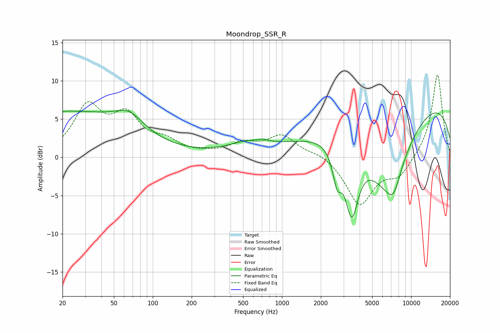

# Moondrop_SSR_R
See [usage instructions](https://github.com/jaakkopasanen/AutoEq#usage) for more options and info.

### Parametric EQs
Apply preamp of -6.2 dB when using parametric equalizer.

|   # | Type    |   Fc (Hz) |    Q |   Gain (dB) |
|-----|---------|-----------|------|-------------|
|   1 | Peaking |        22 | 4.5  |         0.1 |
|   2 | Peaking |        23 | 0.28 |         5.8 |
|   3 | Peaking |        66 | 1.33 |         2.1 |
|   4 | Peaking |       562 | 0.85 |         1.5 |
|   5 | Peaking |       711 | 5.82 |         0.2 |
|   6 | Peaking |      2671 | 4.15 |        -4   |
|   7 | Peaking |      3471 | 2.63 |        -9   |
|   8 | Peaking |      6516 | 0.71 |       -10.6 |
|   9 | Peaking |      7307 | 2.49 |        -2.8 |
|  10 | Peaking |      9137 | 0.18 |         8.8 |

### Fixed Band EQs
When using fixed band (also called graphic) equalizer, apply preamp of **-10.9 dB** (if available) and set gains manually with these parameters.

|   # | Type    |   Fc (Hz) |    Q |   Gain (dB) |
|-----|---------|-----------|------|-------------|
|   1 | Peaking |        31 | 1.41 |         6.3 |
|   2 | Peaking |        62 | 1.41 |         4.8 |
|   3 | Peaking |       125 | 1.41 |         1.7 |
|   4 | Peaking |       250 | 1.41 |         0.2 |
|   5 | Peaking |       500 | 1.41 |         1.6 |
|   6 | Peaking |      1000 | 1.41 |         2.7 |
|   7 | Peaking |      2000 | 1.41 |         0.6 |
|   8 | Peaking |      4000 | 1.41 |        -6.2 |
|   9 | Peaking |      8000 | 1.41 |        -2.4 |
|  10 | Peaking |     16000 | 1.41 |        11   |

### Graphs

