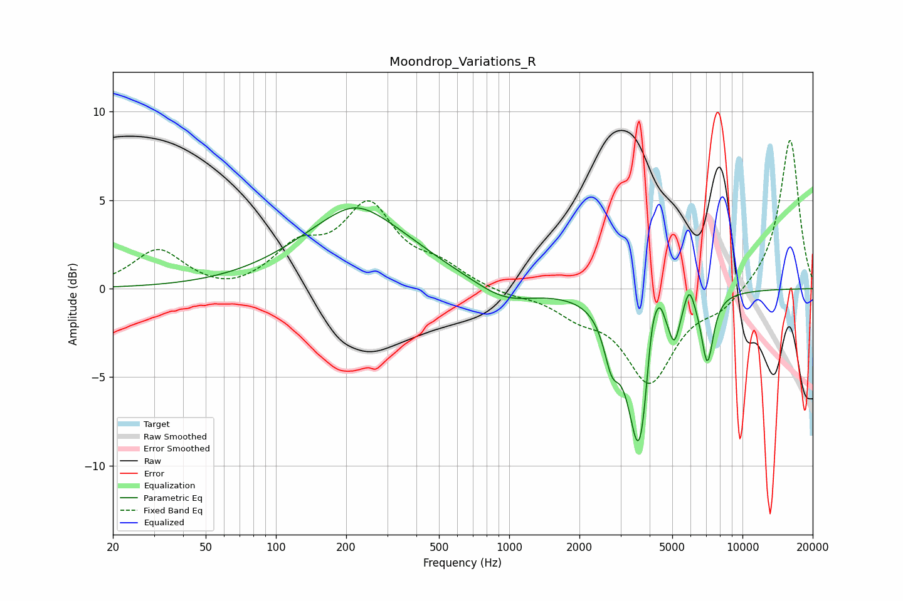

# Moondrop_Variations_R
See [usage instructions](https://github.com/jaakkopasanen/AutoEq#usage) for more options and info.

### Parametric EQs
Apply preamp of -4.7 dB when using parametric equalizer.

|   # | Type    |   Fc (Hz) |    Q |   Gain (dB) |
|-----|---------|-----------|------|-------------|
|   1 | Peaking |       218 | 1.5  |         0.5 |
|   2 | Peaking |       223 | 0.57 |         4.1 |
|   3 | Peaking |       953 | 1.13 |        -1   |
|   4 | Peaking |      2750 | 4.26 |        -2.4 |
|   5 | Peaking |      3624 | 2.85 |        -9.4 |
|   6 | Peaking |      4083 | 5.26 |         3.3 |
|   7 | Peaking |      4424 | 6    |         1.6 |
|   8 | Peaking |      5110 | 5.98 |        -1.8 |
|   9 | Peaking |      5913 | 6    |         1.5 |
|  10 | Peaking |      7073 | 5.36 |        -3.8 |

### Fixed Band EQs
When using fixed band (also called graphic) equalizer, apply preamp of **-8.5 dB** (if available) and set gains manually with these parameters.

|   # | Type    |   Fc (Hz) |    Q |   Gain (dB) |
|-----|---------|-----------|------|-------------|
|   1 | Peaking |        31 | 1.41 |         2.2 |
|   2 | Peaking |        62 | 1.41 |        -0.4 |
|   3 | Peaking |       125 | 1.41 |         2.1 |
|   4 | Peaking |       250 | 1.41 |         4.4 |
|   5 | Peaking |       500 | 1.41 |         1.1 |
|   6 | Peaking |      1000 | 1.41 |        -0.3 |
|   7 | Peaking |      2000 | 1.41 |        -1.2 |
|   8 | Peaking |      4000 | 1.41 |        -5.1 |
|   9 | Peaking |      8000 | 1.41 |        -1   |
|  10 | Peaking |     16000 | 1.41 |         8.5 |

### Graphs

