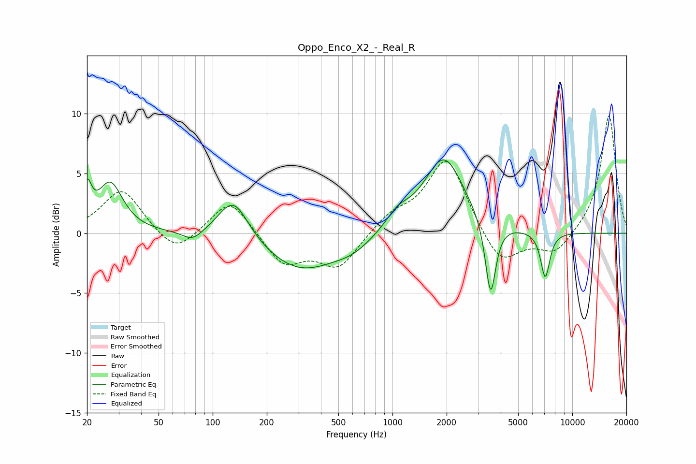

# Oppo_Enco_X2_-_Real_R
See [usage instructions](https://github.com/jaakkopasanen/AutoEq#usage) for more options and info.

### Parametric EQs
Apply preamp of -6.2 dB when using parametric equalizer.

|   # | Type    |   Fc (Hz) |    Q |   Gain (dB) |
|-----|---------|-----------|------|-------------|
|   1 | Peaking |        20 | 5.82 |         3   |
|   2 | Peaking |        27 | 2.07 |         4.1 |
|   3 | Peaking |        77 | 2.54 |        -0.9 |
|   4 | Peaking |       131 | 1.67 |         3.5 |
|   5 | Peaking |       307 | 0.68 |        -3.1 |
|   6 | Peaking |       601 | 1.33 |        -0.8 |
|   7 | Peaking |      1067 | 2.12 |         1.2 |
|   8 | Peaking |      1934 | 1.26 |         6.4 |
|   9 | Peaking |      3511 | 4.85 |        -6.4 |
|  10 | Peaking |      7074 | 5.34 |        -3.8 |

### Fixed Band EQs
When using fixed band (also called graphic) equalizer, apply preamp of **-9.9 dB** (if available) and set gains manually with these parameters.

|   # | Type    |   Fc (Hz) |    Q |   Gain (dB) |
|-----|---------|-----------|------|-------------|
|   1 | Peaking |        31 | 1.41 |         3.7 |
|   2 | Peaking |        62 | 1.41 |        -1.9 |
|   3 | Peaking |       125 | 1.41 |         3   |
|   4 | Peaking |       250 | 1.41 |        -2.7 |
|   5 | Peaking |       500 | 1.41 |        -2.9 |
|   6 | Peaking |      1000 | 1.41 |         1.4 |
|   7 | Peaking |      2000 | 1.41 |         6.4 |
|   8 | Peaking |      4000 | 1.41 |        -2.9 |
|   9 | Peaking |      8000 | 1.41 |        -1.8 |
|  10 | Peaking |     16000 | 1.41 |        10   |

### Graphs

