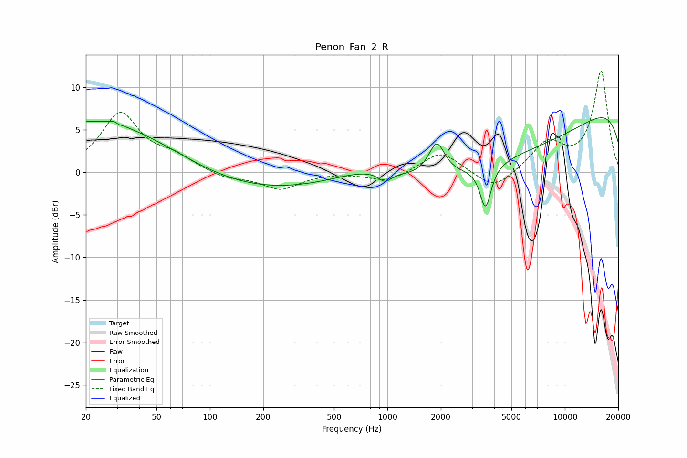

# Penon_Fan_2_R
See [usage instructions](https://github.com/jaakkopasanen/AutoEq#usage) for more options and info.

### Parametric EQs
Apply preamp of -6.5 dB when using parametric equalizer.

|   # | Type    |   Fc (Hz) |    Q |   Gain (dB) |
|-----|---------|-----------|------|-------------|
|   1 | Peaking |        22 | 0.31 |         6.3 |
|   2 | Peaking |        30 | 5.59 |         3   |
|   3 | Peaking |        30 | 5.94 |        -2.8 |
|   4 | Peaking |       173 | 0.33 |        -2.3 |
|   5 | Peaking |       769 | 0.77 |         1.3 |
|   6 | Peaking |       969 | 4.04 |        -1.1 |
|   7 | Peaking |      1896 | 3.16 |         3.9 |
|   8 | Peaking |      3572 | 4.54 |        -5   |
|   9 | Peaking |      5311 | 0.24 |        -7.8 |
|  10 | Peaking |     10000 | 0.18 |        11.1 |

### Fixed Band EQs
When using fixed band (also called graphic) equalizer, apply preamp of **-12.0 dB** (if available) and set gains manually with these parameters.

|   # | Type    |   Fc (Hz) |    Q |   Gain (dB) |
|-----|---------|-----------|------|-------------|
|   1 | Peaking |        31 | 1.41 |         6.8 |
|   2 | Peaking |        62 | 1.41 |         1.5 |
|   3 | Peaking |       125 | 1.41 |        -0.8 |
|   4 | Peaking |       250 | 1.41 |        -2   |
|   5 | Peaking |       500 | 1.41 |         0   |
|   6 | Peaking |      1000 | 1.41 |        -1.2 |
|   7 | Peaking |      2000 | 1.41 |         2.5 |
|   8 | Peaking |      4000 | 1.41 |        -2.2 |
|   9 | Peaking |      8000 | 1.41 |         3.3 |
|  10 | Peaking |     16000 | 1.41 |        11.9 |

### Graphs

