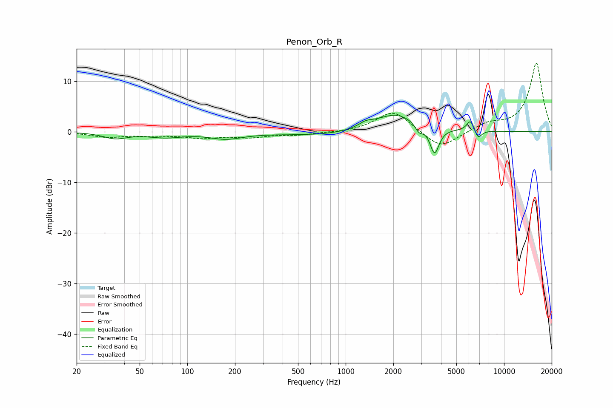

# Penon_Orb_R
See [usage instructions](https://github.com/jaakkopasanen/AutoEq#usage) for more options and info.

### Parametric EQs
Apply preamp of -3.3 dB when using parametric equalizer.

|   # | Type    |   Fc (Hz) |    Q |   Gain (dB) |
|-----|---------|-----------|------|-------------|
|   1 | Peaking |        35 | 1.9  |        -1.2 |
|   2 | Peaking |        72 | 1.28 |        -1   |
|   3 | Peaking |       176 | 1.36 |        -1.2 |
|   4 | Peaking |       791 | 0.45 |        -0.8 |
|   5 | Peaking |      1336 | 3.22 |         0.9 |
|   6 | Peaking |      2066 | 1.02 |         3.8 |
|   7 | Peaking |      2906 | 5.72 |        -1.6 |
|   8 | Peaking |      3641 | 4.84 |        -5.3 |
|   9 | Peaking |      6144 | 5.9  |         2.3 |
|  10 | Peaking |      6858 | 6    |        -1.8 |

### Fixed Band EQs
When using fixed band (also called graphic) equalizer, apply preamp of **-13.6 dB** (if available) and set gains manually with these parameters.

|   # | Type    |   Fc (Hz) |    Q |   Gain (dB) |
|-----|---------|-----------|------|-------------|
|   1 | Peaking |        31 | 1.41 |        -1   |
|   2 | Peaking |        62 | 1.41 |        -0.6 |
|   3 | Peaking |       125 | 1.41 |        -1.1 |
|   4 | Peaking |       250 | 1.41 |        -1   |
|   5 | Peaking |       500 | 1.41 |        -0.6 |
|   6 | Peaking |      1000 | 1.41 |        -0.2 |
|   7 | Peaking |      2000 | 1.41 |         4.2 |
|   8 | Peaking |      4000 | 1.41 |        -3.5 |
|   9 | Peaking |      8000 | 1.41 |         1.5 |
|  10 | Peaking |     16000 | 1.41 |        13.6 |

### Graphs

