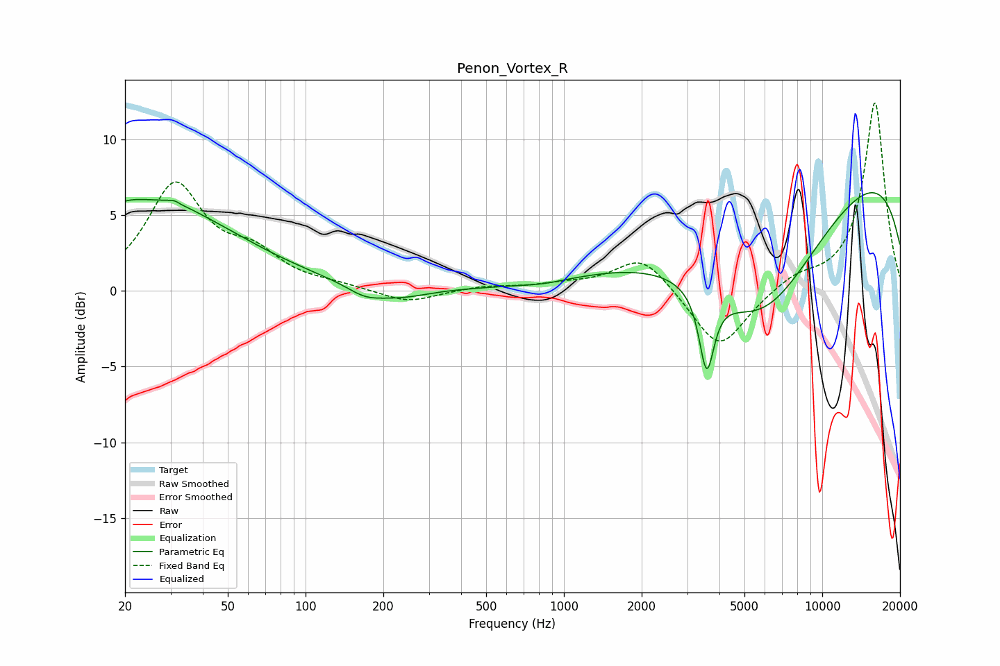

# Penon_Vortex_R
See [usage instructions](https://github.com/jaakkopasanen/AutoEq#usage) for more options and info.

### Parametric EQs
Apply preamp of -6.6 dB when using parametric equalizer.

|   # | Type    |   Fc (Hz) |    Q |   Gain (dB) |
|-----|---------|-----------|------|-------------|
|   1 | Peaking |        20 | 2.19 |         0.3 |
|   2 | Peaking |        25 | 0.43 |         5.8 |
|   3 | Peaking |        32 | 5.18 |         3.5 |
|   4 | Peaking |        32 | 5.38 |        -3.3 |
|   5 | Peaking |       170 | 1.96 |        -0.7 |
|   6 | Peaking |       234 | 1.33 |        -0.6 |
|   7 | Peaking |       831 | 1.66 |        -0.2 |
|   8 | Peaking |      3569 | 4.93 |        -5.3 |
|   9 | Peaking |      5810 | 0.53 |        -9.8 |
|  10 | Peaking |      9746 | 0.18 |         9.5 |

### Fixed Band EQs
When using fixed band (also called graphic) equalizer, apply preamp of **-12.5 dB** (if available) and set gains manually with these parameters.

|   # | Type    |   Fc (Hz) |    Q |   Gain (dB) |
|-----|---------|-----------|------|-------------|
|   1 | Peaking |        31 | 1.41 |         6.8 |
|   2 | Peaking |        62 | 1.41 |         2   |
|   3 | Peaking |       125 | 1.41 |         0.3 |
|   4 | Peaking |       250 | 1.41 |        -0.8 |
|   5 | Peaking |       500 | 1.41 |         0.3 |
|   6 | Peaking |      1000 | 1.41 |         0.3 |
|   7 | Peaking |      2000 | 1.41 |         2.4 |
|   8 | Peaking |      4000 | 1.41 |        -4   |
|   9 | Peaking |      8000 | 1.41 |         0.9 |
|  10 | Peaking |     16000 | 1.41 |        12.5 |

### Graphs

